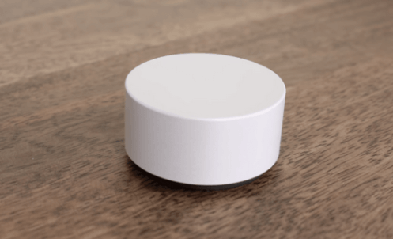
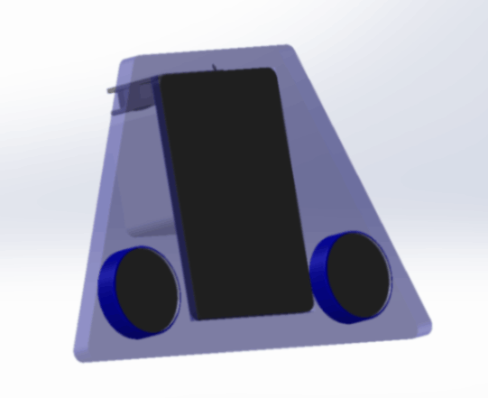
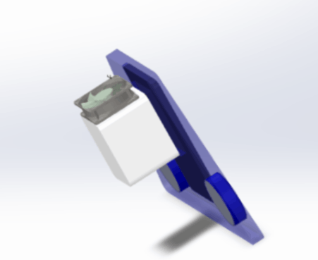
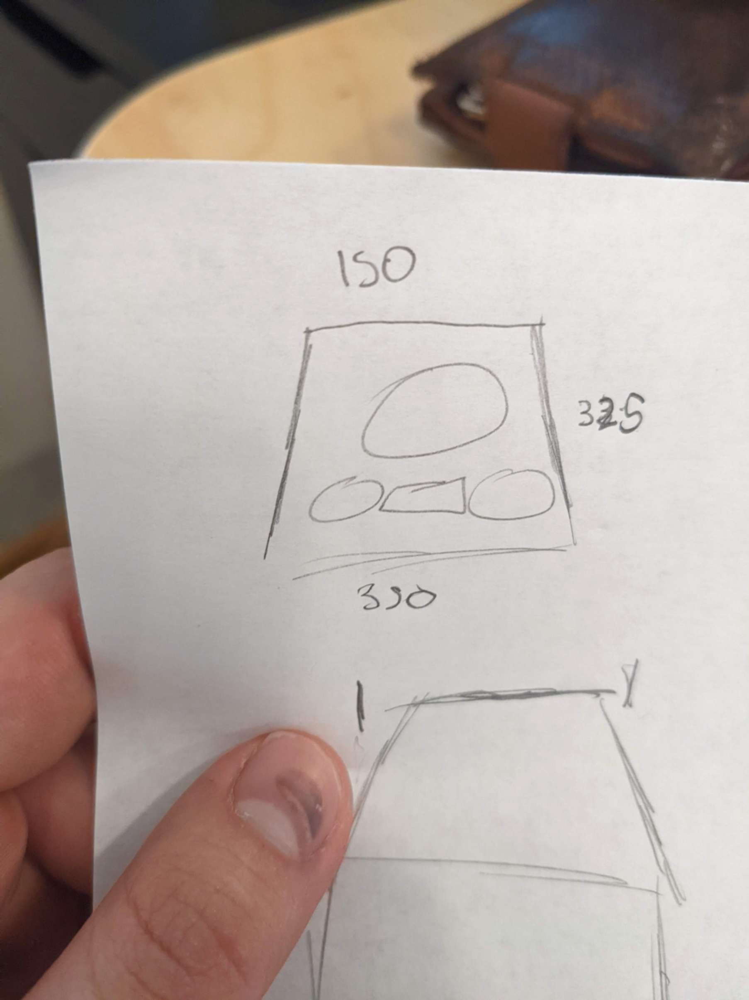
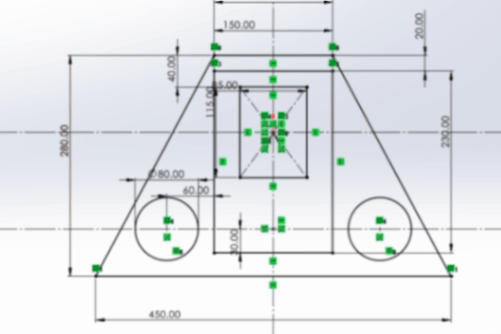
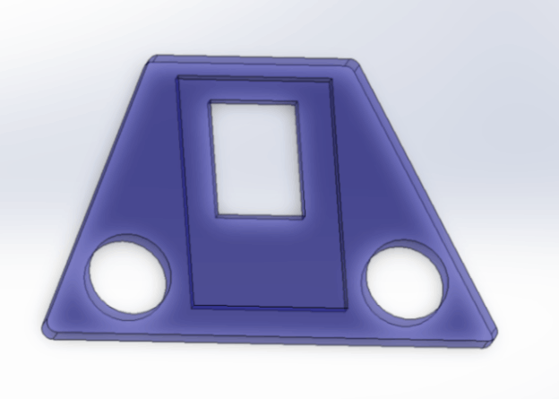
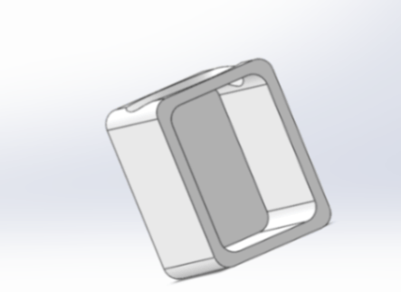
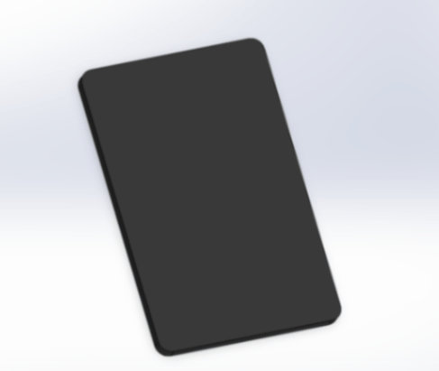
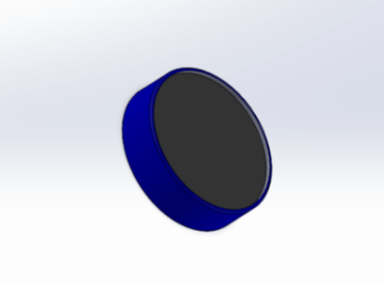

# Week 1: 3d design (MIT How to Make (Almost) Anything, fall 2022)

_Converted from Ahmad's class documentation page (`menya_project/archive/menya_how_to_make/people/Ahmad/page/week-1-details.html`)._

#### Week 1: 3D Design

- **Date**: September 7th 2022 - September 13th 2022

#### Week 1: Designing my Final Project

 For my Final Project I have decided to make a new dashboard for my Car.

#### Motivation

 When I'm driving my car, its really annoying to change music. My car is old so it uses an Aux. I have to put my password in and basically distract myself to play music.

#### Design Requirements:

 1. I would like it to fit other future vehicles that I make/buy
 2. Should be resistant to noise and reliable
 3. Should be easy to interact with
 4. I want to have a joystick/mouse that looks like it came from a microsoft product

### The Process So far

#### Dashboard Case/Cover

##### The Main Body

This part will define how my dashboard looks, which in turn will determine how I interact with it.

 To Design it I first start with a crude sketch:

 After such a great drawing, I decided to start CADing immediately

I then extruded the sketch to make the full part

#### On-board Computer Case

##### CADing the On-board computer

 My goal with having the on-board computer is to be able to interface it with smaller analog/ digital devices that I create. Such as a proximity sensor for when I want to make clean cuts.

 Since this will most likely change in the future I designed the main case with as little of the functionality as possible

 The Main two things I wanted was a duct for a fan to cool the onboard computer down and also to hold it in place

#### The Screen and Speedometer

##### the Screen

After CADing all the other stuff this was pretty straight forward. Make a square and fillet and chamfer until it looks like a screen

##### Speedometer

#### Putting it Together

##### the Assembly

This was the annoying part, I wanted to make the assembly in a way, such that when I edited a component sketch it will auto update to the assembly

However whenever I updated a part I would get an error in the assembly mates

 After a short learning curve I learned not to reference faces or features when mating. The proper way is to reference sketches

