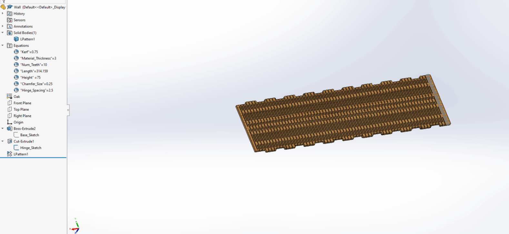
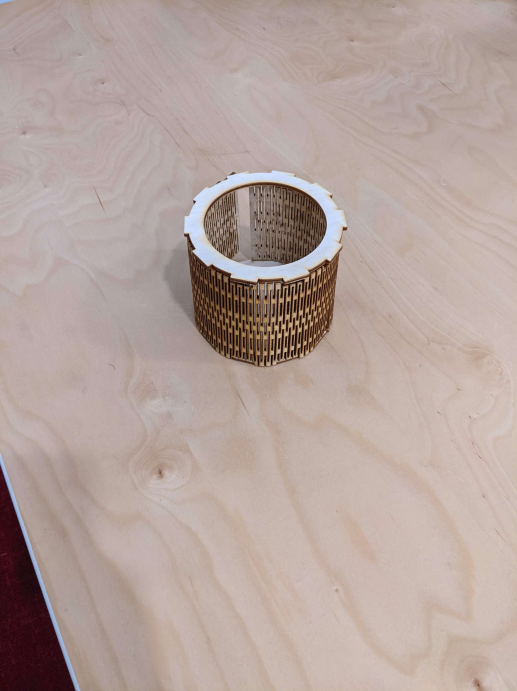
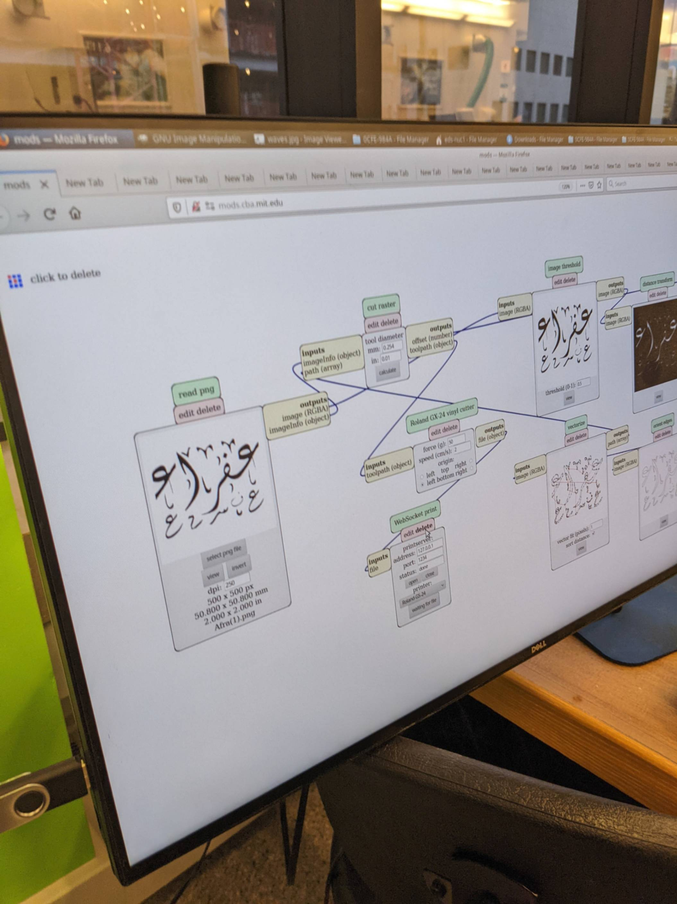
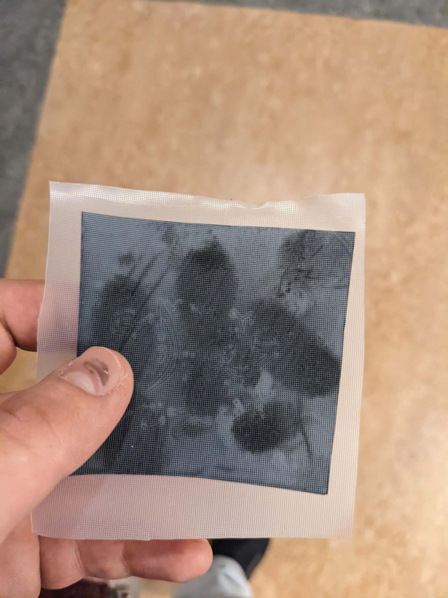
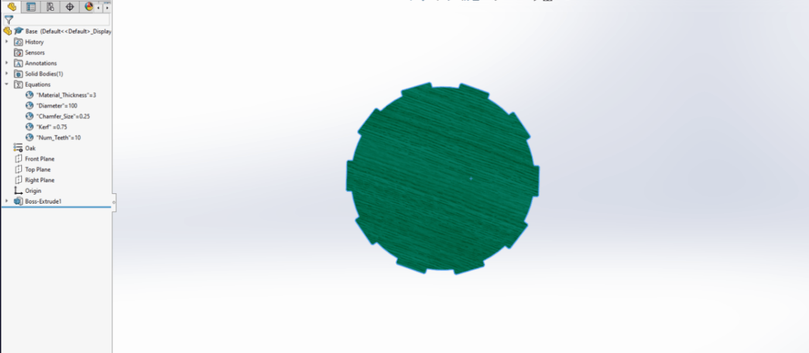
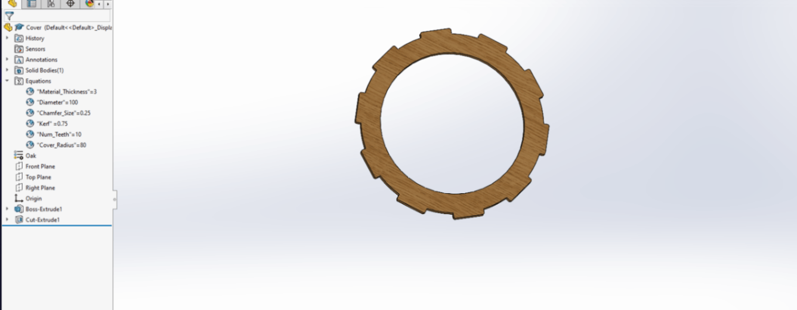
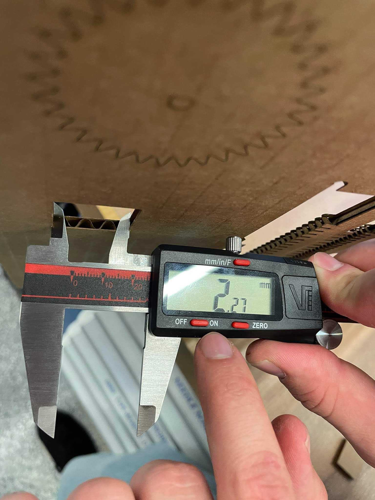

# Week 2: laser and vinyl cutting (MIT How to Make (Almost) Anything, fall 2022)

_Converted from Ahmad's class documentation page (`menya_project/archive/menya_how_to_make/people/Ahmad/page/week-2-details.html`)._

#### Week 2: 3D Design

- **Date**: September 14th 2022 - September 20th 2022

#### Week 2: Vinyl and Laser Cutting

#####  Vinyl Cutting

Decided to make my Mom's name in Arabic Calligraphy

##### Laser Cutting

Since I have a good amount of prior knowledge on laser cutting I decided to focus this week on making a good parametric part for making living hinges in SolidWorks

### Week 2

#### Vinyl Cutting

##### My Mom's name in Arabic Calligraphy

Used an online tool to make her name into a PNG.

Then I binarized the image for the vinyl cutter

Finally I cut it out

#### Laser Cutting

##### Living hinge parameterized design

 My goal was to create a file I can change just a few parameters and get a working living hinge

 After several hours of painstaking CADing, I was able to achieve my goal... Or at least the most basic requirements of it

 This file lets you change just a few numbers and then spits out a living hinge. you can change the size of your hinge, the spacing between each hinge (varies stiffness), and few other small parameters like the chamfer for your finger joints, and material thickness.

#### Making Something with It

##### A Cup

After I made the hinge, I thought what would be the best way to test my design, and not break it?
 After some though I came up with a Cup.

##### Base

Compared to the hinge making this in CAD was very simple

##### Cover

Finally to make it a cup it needs a cover and making that was super simple. I just took the base and put a hole through it

#### Group Assignment

#####  Characterizing Our Laser

For our group assignment this week we had to characterize our laser and find the best settings for cutting carboard. We found that to cut cardboard we need a power of 75% and speed of 10%. After we figured out the settings to cut the cardboard we calculated the kerf to be ~1.14mm

