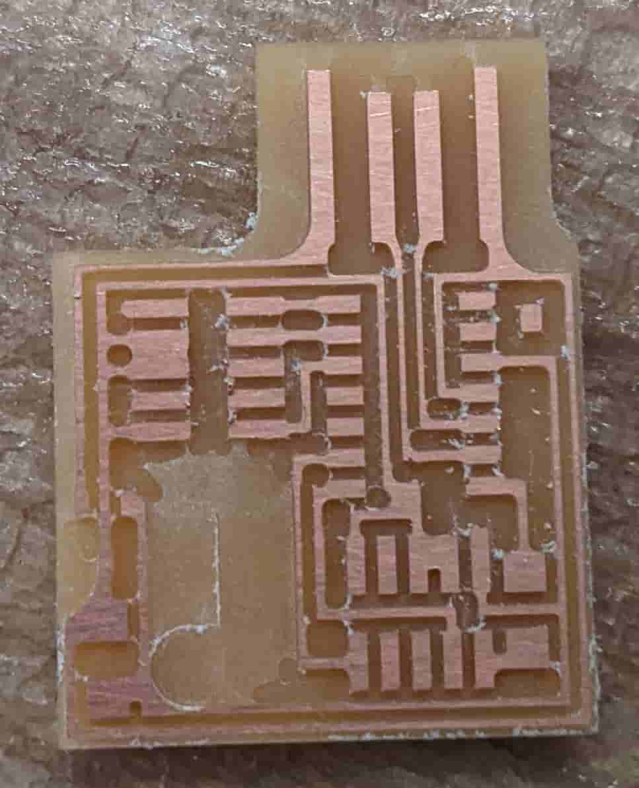
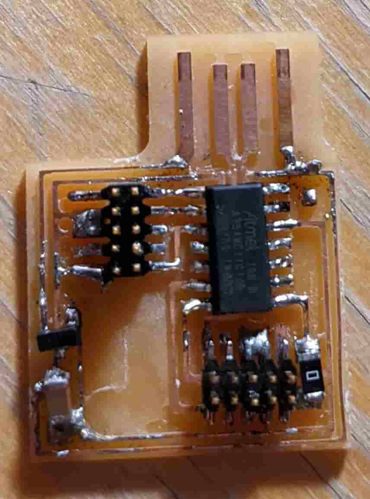
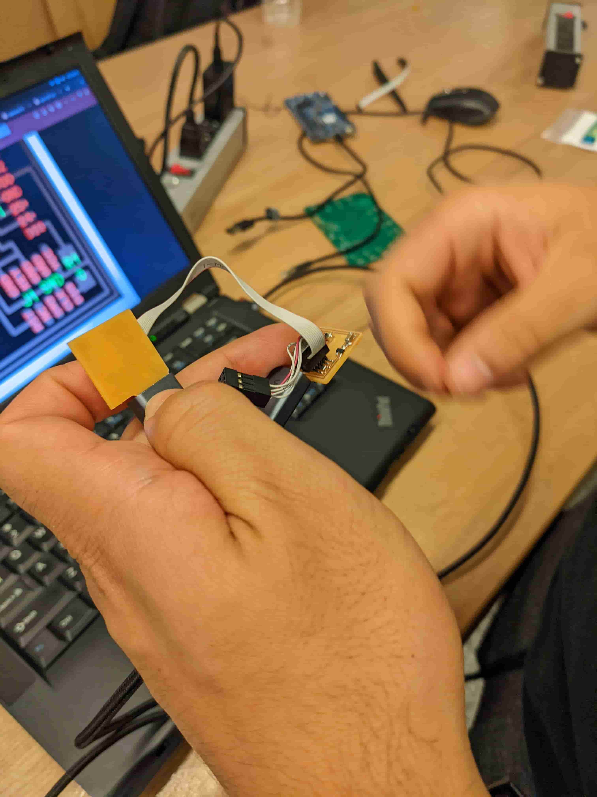
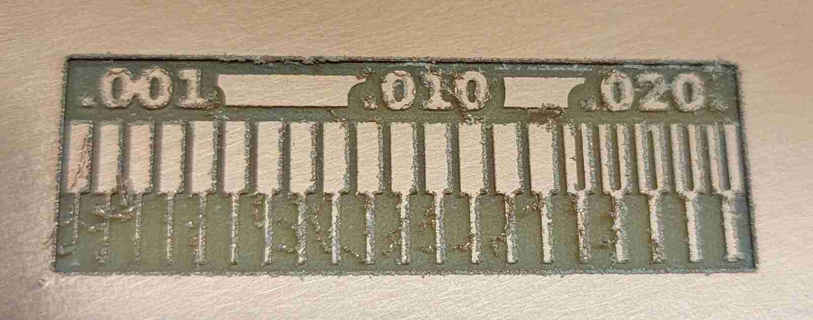
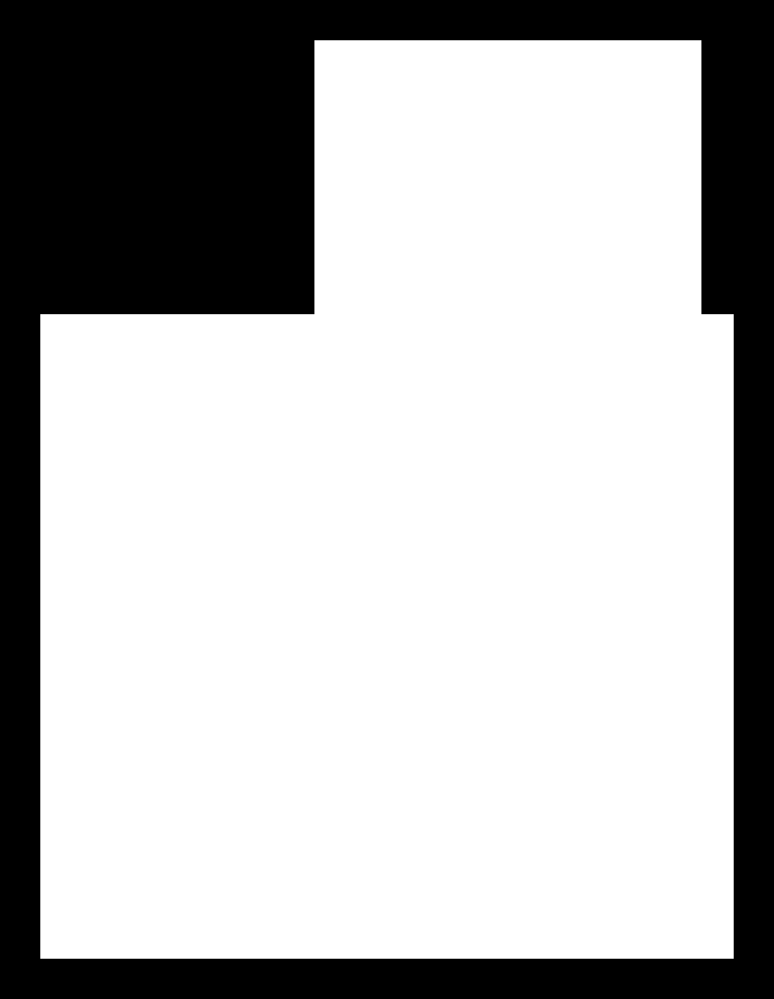
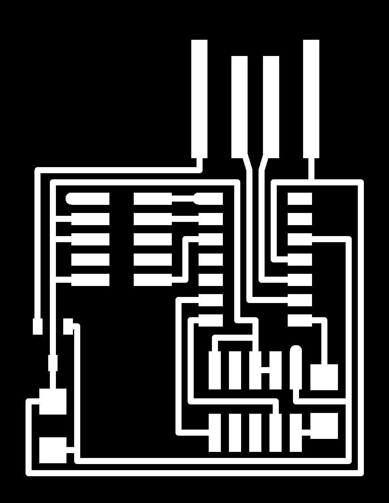
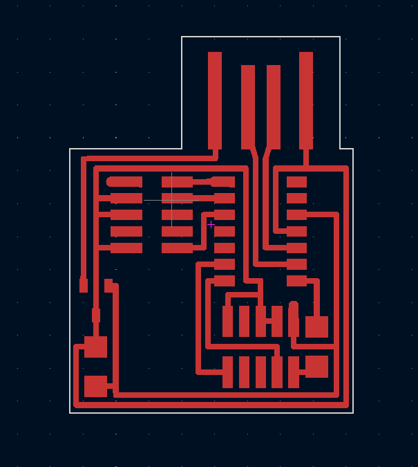
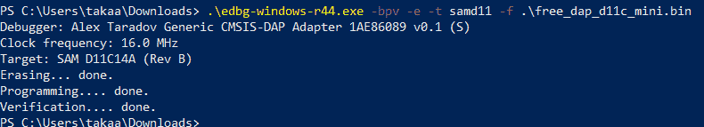

# Week 3: electronics production (MIT How to Make (Almost) Anything, fall 2022)

_Converted from Ahmad's class documentation page (`menya_project/archive/menya_how_to_make/people/Ahmad/page/week-3-details.html`)._

#### Week 3: Electronics Production

- **Date**: September 21st 2022 - September 28th 2022

##### Making a D11C Programmer

Task: manufacture a Programmer

For this weeks assignment I needed to manufacture a PCB Programmer, I was able to complete this task quite quickly, giving me enough time to make another one using a different process

### Electronics Production

#### Group Assignment: Characterizing the Mill

 For our group assignment this week we had to get the design constraints of our mill. The reason we have to do this is because we need to see what the minimum trace size and clearance has to be in order for us to mill out our PCBs. We started by making a test PCB that has varying trace sizes and clearances and lets us identify the proper constraints for our Programmer PCB and future PCBs. We found that our traces and minimum clearance should be 16 mill with a 1/64" endmill. Anything below this could be done but would require a different drill bit.

#### Generating the Gerber Files

 The first step in making any PCB on the mill is we need to generate our gerber board files. To do this I took the png images from the cba website ( [here](http://academy.cba.mit.edu/classes/embedded_programming/SWD/hello.CMSIS-DAP.10.D11C.traces.png) and [here](http://academy.cba.mit.edu/classes/embedded_programming/SWD/hello.CMSIS-DAP.10.D11C.interior.png)) and ran it through KiCAD 6.0's image converter. The image converter outputs a text file that you can modify to make into a footprint on any layer ([this](https://youtu.be/DQ6Ta2K9pZk) online guide has more details on the process). Once you modified the proper file you should be left with a foot print you can import into KiCAD.

#### Milling out the PCB

 To mill out this PCB I used the Bantom mill in EDS. This mill is really good for prototyping, however it has some limits. The software that comes with the mill only allows you to change the toolhead 3 times. So if your project requires a wide variety of bits, or you just want to save speed (1/64, 1/32, 1/100, 1/8), like I do for this programmer, then you have to do some clever workarounds. First when I inputted my board (which neal gave us) I saw a lot of red which means you need to change the toolhead to mill it. After I changed the toolhead to 1/64 the red was still there. So then I did what any sane person would do I lied to the computer and told it that I had the 1/100" toolhead, when in fact it did not. However, now I had another problem the computer was telling me It would take an hour to mill out all the traces. To get around this I had it go through the first part of the job with the 1/64" and 1/100" (actually 1/64") bit then canceled the job and then restarted the file by telling the software to cut the 1/8" and 1/32" traces.

[Video: mill.mp4](../images/week03/mill.mp4)

#### Soldering The Components

 Unfortunately all the time I saved milling was immediately spent soldering. I was waiting a long time for a Soldering station to open in EDS so I decided to take one of the bigger irons and some leaded solder and go at it by hand. It took about 45 minutes however I didn't do the greatest job. Next time I'll use solder paste/flux. After I got the soldering done I checked for shorts with a multimeter. I corrected the only short I found by using the solder suction. Then, I was left with a nice finished PCB.

#### Programming The Board

 This was the fun part seeing if it worked. To make my piece of copper a board I needed to program in the firmware to the microcontroller. To do this we needed to find a programmer compatible with our board type. We ended up using the Atmel CMSIS Programmer. I plugged it in the SWD input on my board then ran edgb on my machine and I turned my copper into a programmer. Then to test it I used my board to program another board, and it worked.

