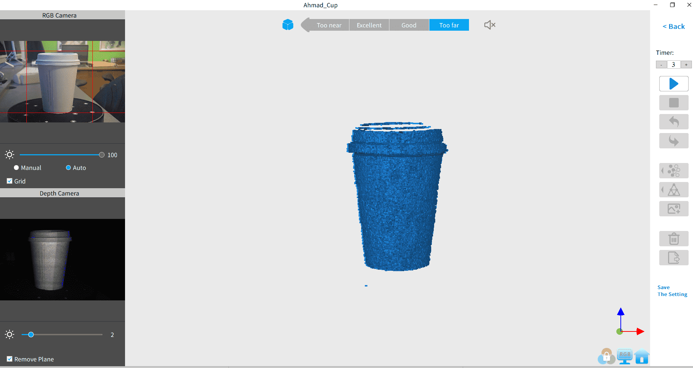
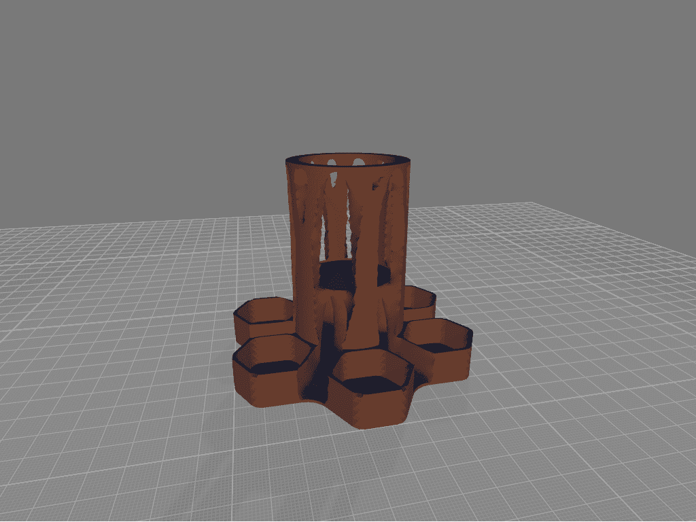
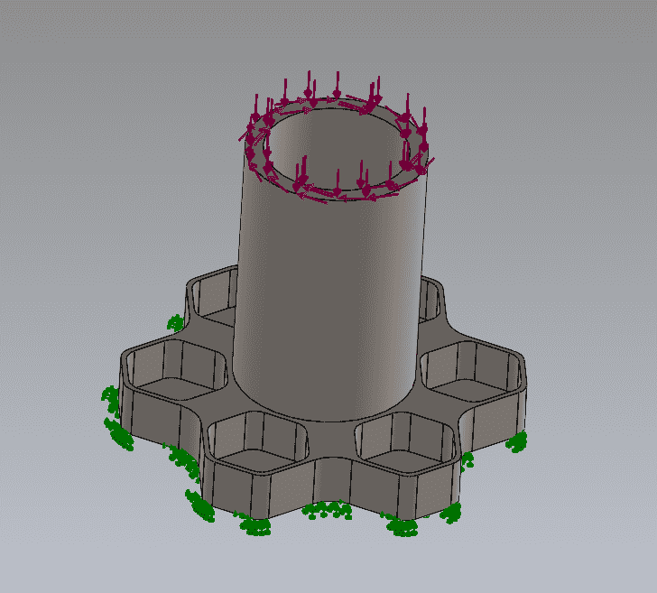
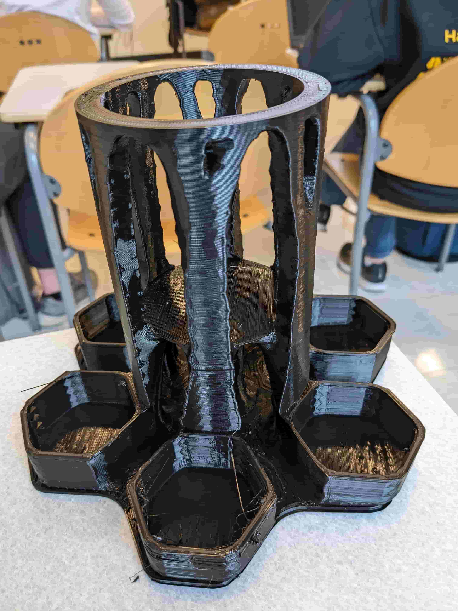
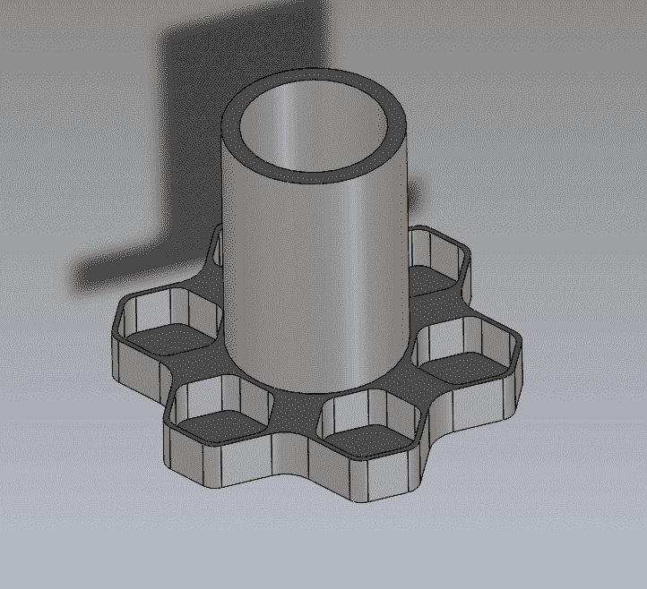
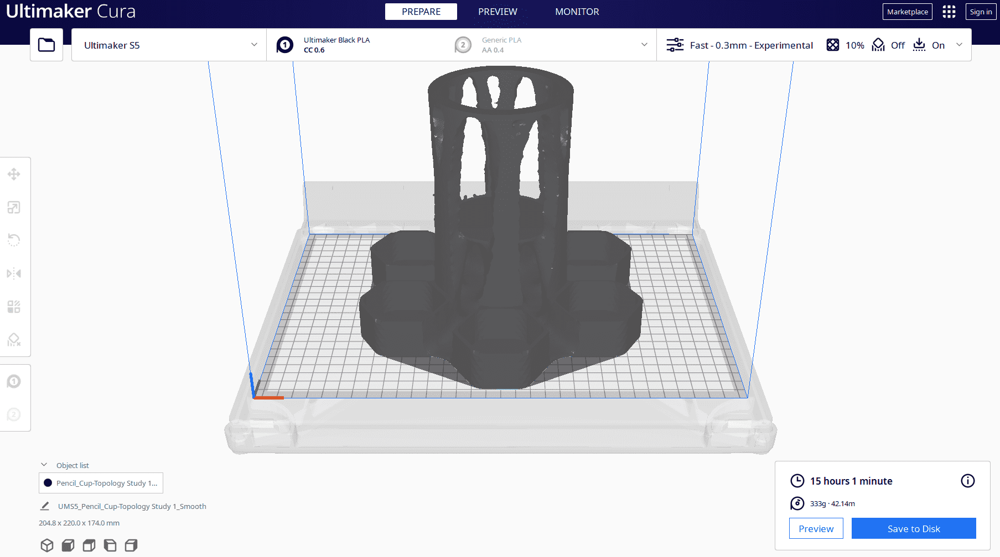
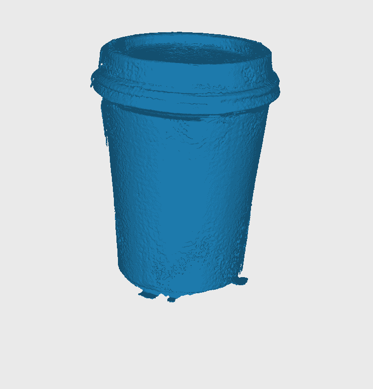
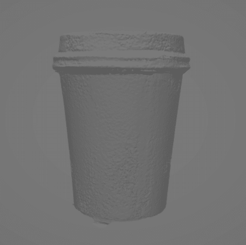

# Week 4: 3d printing (MIT How to Make (Almost) Anything, fall 2022)

_Converted from Ahmad's class documentation page (`menya_project/archive/menya_how_to_make/people/Ahmad/page/week-4-details.html`)._

#### Week 4: 3D Printing

- **Date**: September 29th 2022 - October 5th 2022

##### 3D Printing an Alien Design

Task: 3D Print something that cannot be made subtractively

For this weeks assignment I decided I wanted to make something that looked like it wasn't designed by a human. To do this I learned how to use Topology Optimization.

#### The Base Design

 Before I started I had to figure out what I was going to design. So I went online looking for cool things to make. As I was scrolling I found cool organic looking designs that were created using Topology Optimization. So I decided to use Solidworks Topology Study to make my alien looking part. First I had to make my part. I decided to make a pencil cup for my drawing supplies.

#### Topology Optimization

 After watching a very basic [tutorial video](https://www.youtube.com/watch?v=wYhOhYffyNo&t=146s) I created a topology study in SolidWorks for my part. I placed the relevant loads on my part, fixing on the bottom face (green arrows), a pressure on the top faces of 1 MPa (Red Arrows) and Torque of 1 Nm on the top face ring (Purple Arrow). After placing the loads I told SolidWorks to run the optimization while minimizing mass and maintaining stiffness. The study took about forty minutes and generated a nice alien looking mesh.

#### Printing the Optimized Mesh

 I used a an Ultimaker 5S with Black PLA to print this. In order to get it to print in under a day I raised the layer height to 0.2 mm and changed the nozzle size to 0.6 mm. The print took roughly 16 hrs and looked really good.

#### 3D Scanning

 For the 3D scanning section of my assignment I decided to 3D Scan the first thing I had in my vicinity, my disposable coffee cup. At first I tried to scan it a few times only to realize that the scanner doesn't stop automatically and I have to stop it myself. I relized this after half an hour of letting it run. After I figured out how to use the software. I stopped the scanner when it correctly interpolated the coffee cup mesh. This was after 2 minutes and it generated 1,852,290 faces and 923,129 vertices. I played around with meshlab to try and fix the some of the mesh and 3D print it, however It ultimately crashed and I was too tired to try it again.

