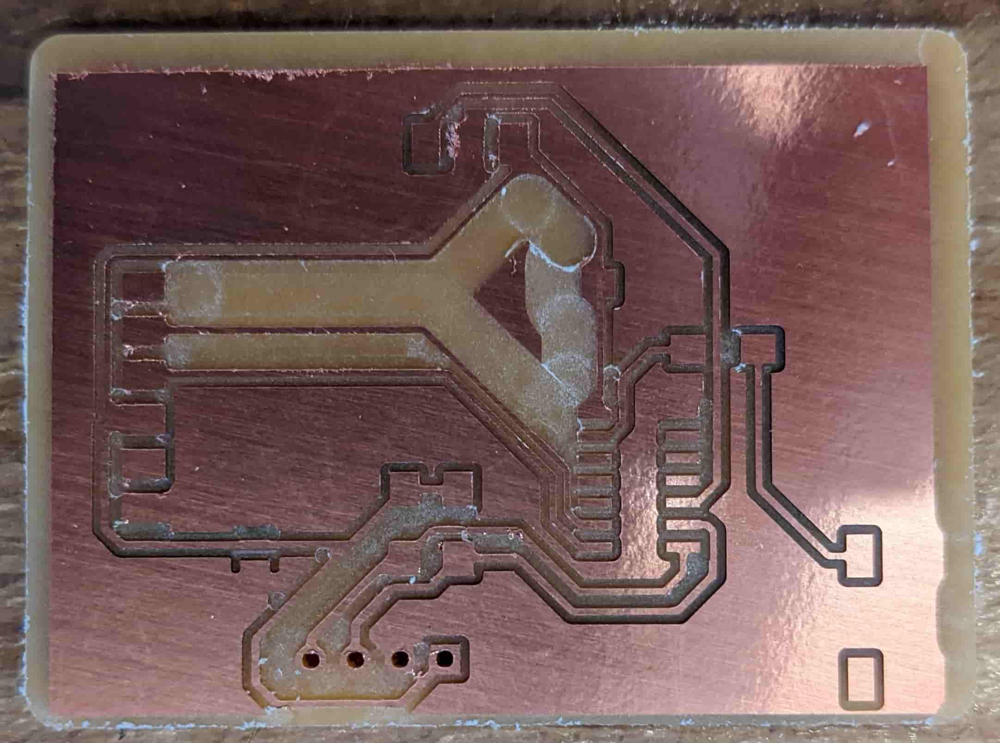
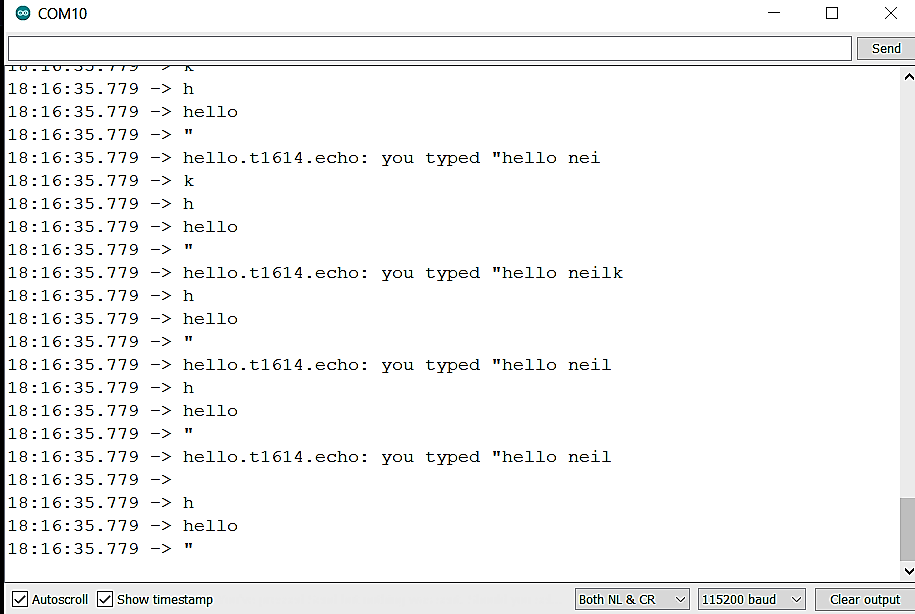
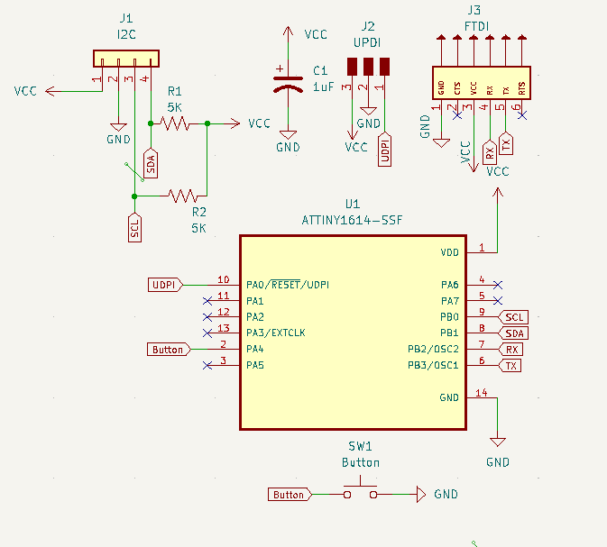
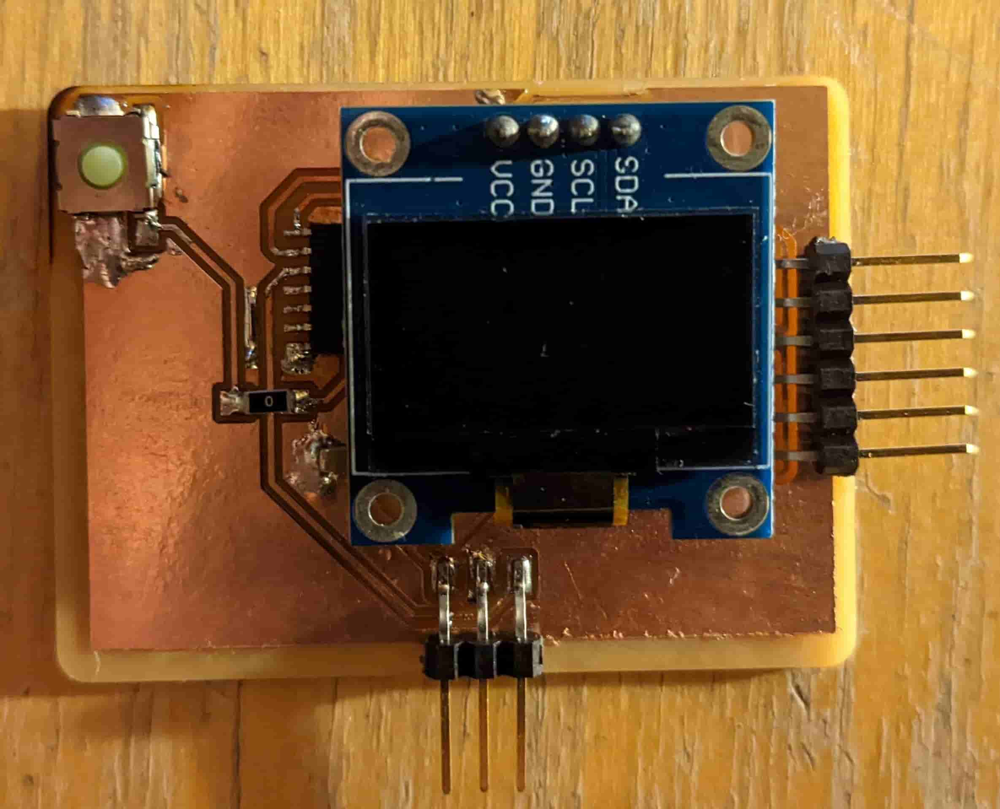
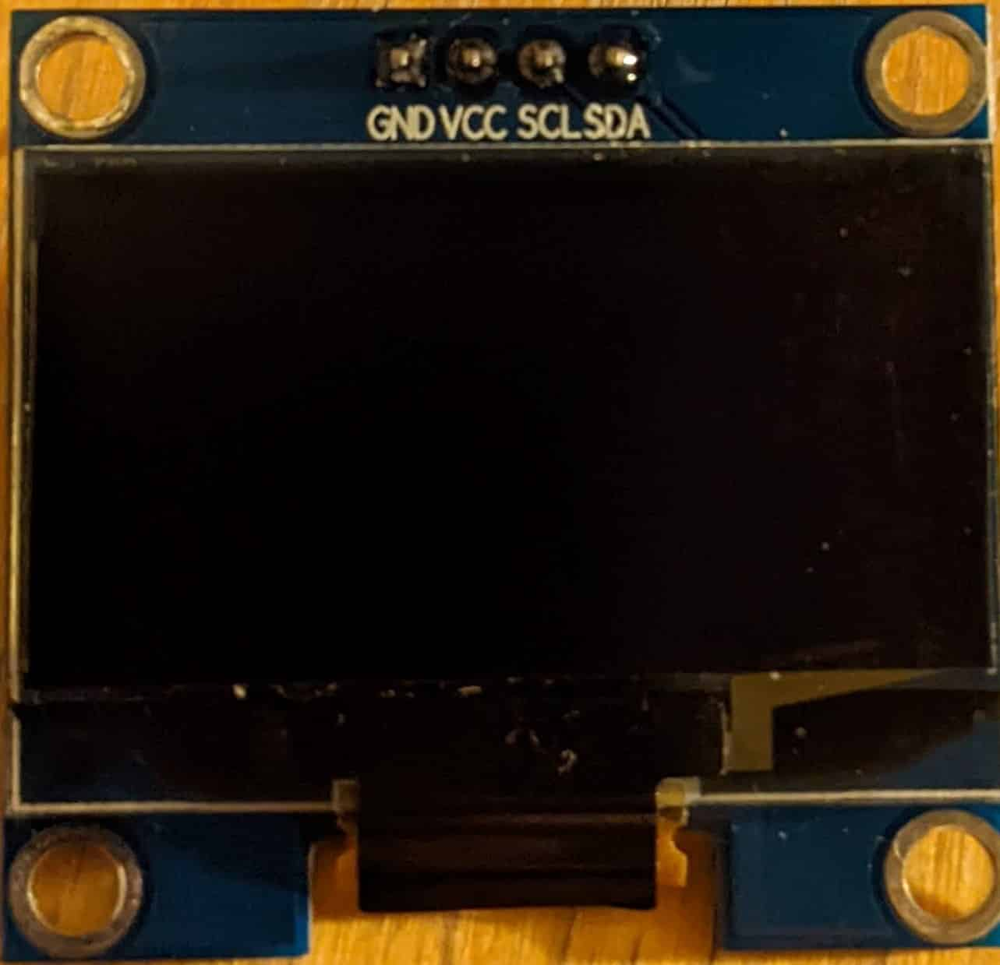
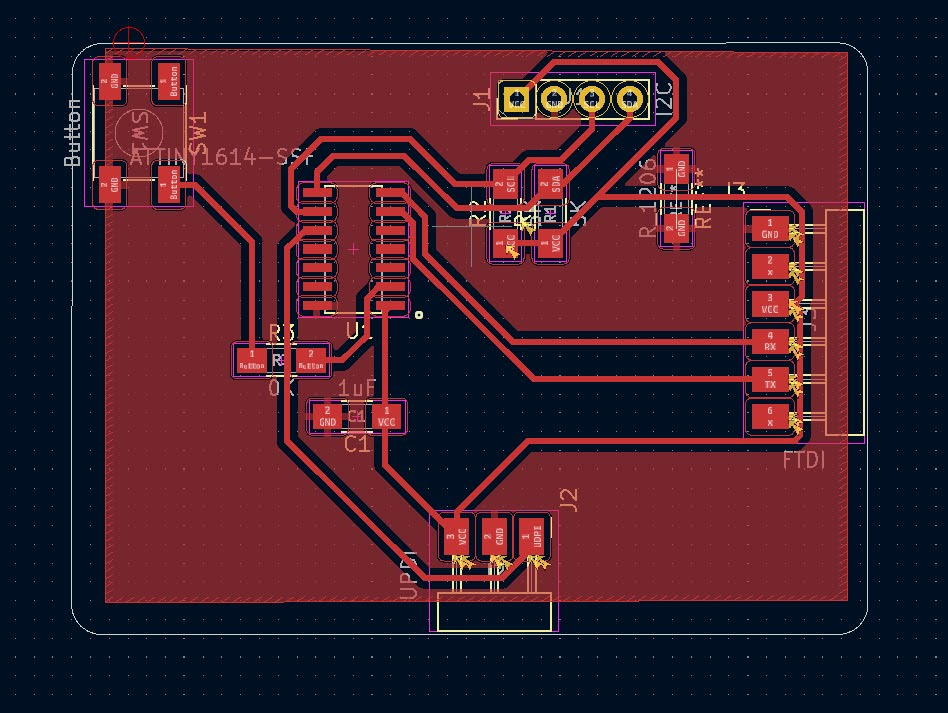
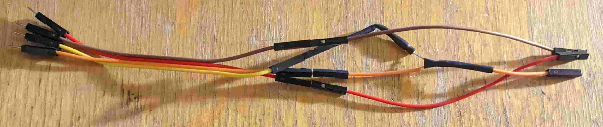

# Week 5: electronics design (MIT How to Make (Almost) Anything, fall 2022)

_Converted from Ahmad's class documentation page (`menya_project/archive/menya_how_to_make/people/Ahmad/page/week-5-details.html`)._

#### Week 5: Electronic Design

- **Date**: October 6th 2022 - October 12th 2022

##### Making a PCB with a OLED Display

Task: Design a version of the Echo Hello World Board with at least a button and LED

 For this weeks assignment I decided I wanted to design a PCB for my final project. This PCB will act as the audio display for music and will sit on the dashboard of the ATV.

#### The Base Design

 Before I started I had to figure out what components I want to use. I first started with the MCU (MicroController); I picked the ATiny1614 this MCU has 20hz clock and can be powered with either 3.3V or 5V supply. Next I chose the OLED screen, I found a standard [0.96inch SSD1306 OLED](https://www.amazon.com/PEMENOL-Display-0-96inch-Raspberry-Microcontroller/dp/B07F3KY8NF) in the lab which Anthony was kind enough to give me. Next I needed to configure a Serial Output port and a Programming port. Reading the datasheet for the ATtiny1614 I found that I can program the board through UPDI and read Serial via a standard serial port. Since UPDI is just serial with RX and TX tied together to program all I need is a USB to serial programmer which we have at the EDS lab. Utilizing this information I was able to design a schematic. I added a small button which can be configured to do something later.

#### Routing the Traces and Milling the Board

 After laying out the schematic and checking all the pins I began routing the traces. Before I started I set the constraints of our machine into my design, from a couple of weeks ago this was found to be 16 mil trace clearance and width. Once the design rules were set I was able to start routing traces. This was fairly annoying, at first I tried to do it with as little 0 Ohm jumpers as possible. However, I soon realized how futile this is and embraced the jumpers. I ended up with only 2 jumpers. I added a ground pour which is nice cause all the grounds would be connected and I end up with less to mill out.

 Once I routed all the traces I ran it through the DRC (Design Rules Checker ) to check everything was within the constraints. The results came back with no significant errors (had 3 for the jumpers). Then I generated the gerber files and sent it to the mill to be milled out. The results were great I didn't even need to sand the board like last time. I used 1/64" PCB conservative, 1/32" flat end mill, and 1/8" flat end mill to mill out the board.

#### Soldering and Placing the Components

 I'm glad to say that I really learned my lesson from last time. I was patient and waited for a proper station to open up and used flux with only a tiny amount of solder. This time around my soldering came out quite well. However, my nice soldering job was soon overshadowed by a few shorts on my board. I removed the components from my board only to realize it actually wasn't my soldering it was just a tiny piece of copper left over from the mill. Something that I would have caught if I sanded the board. Lesson learned again.

#### Programming the Board with Echo Hello World

 Now for the real test. To prove that my design met the bare minimum of success. I needed to program it with the Echo Hello World ino [file](http://academy.cba.mit.edu/classes/embedded_programming/t1614/hello.t1614.echo.ino). To this I first configured my Arduino IDE to be able program the ATtiny MCUs. I followed the instructions laid out by our well versed TA Anthony. First I opened up my Arduino IDE and went to File > Preferences > Additional Board Managers and added this link [http://drazzy.com/package_drazzy.com_index.json](http://drazzy.com/package_drazzy.com_index.json). Then I went to Tools > Board > Boards Manager and Typed ATtinyCore and downloaded the manager by SpenceKonde. Then I reloaded my IDE and went to  Tools  and selected my board and chip which is the ATTiny1614. I also selected the Programmer to be "Serial UPDI - SLOW". After configuring the IDE and connecting my board though the UPDI port. I compiled and uploaded the echo sketch successfully. Then I plugged the programmer into the FTDI port on my board and was able to send and receive responses. Finally, my board works.

#### Programming the Board with my Custom Display Firmware

 After having a successful initial test I was feeling confident enough to push my board to the limit and see if everything is working. So I wrote my custom firmware to change the OLED screen to black when the button is pressed and white otherwise. Small disclaimer I downloaded the Adafruit GFX and SSD1306 Arduino Libraries (Tools > Manage Libraries). And Since the pins I used for I2C were hardware I2C I just needed to compile the code and upload.

 [Download Code](../images/week05/firmware.ino)

[Video: video_result.mp4](../images/week05/video_result.mp4)
