# Week 6: computer controlled machining (MIT How to Make (Almost) Anything, fall 2022)

_Converted from Ahmad's class documentation page (`menya_project/archive/menya_how_to_make/people/Ahmad/page/week-6-details.html`)._

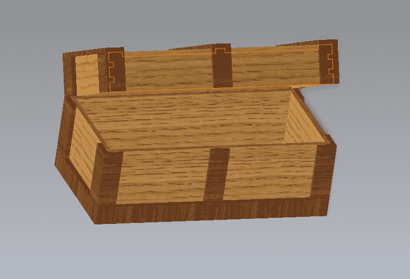

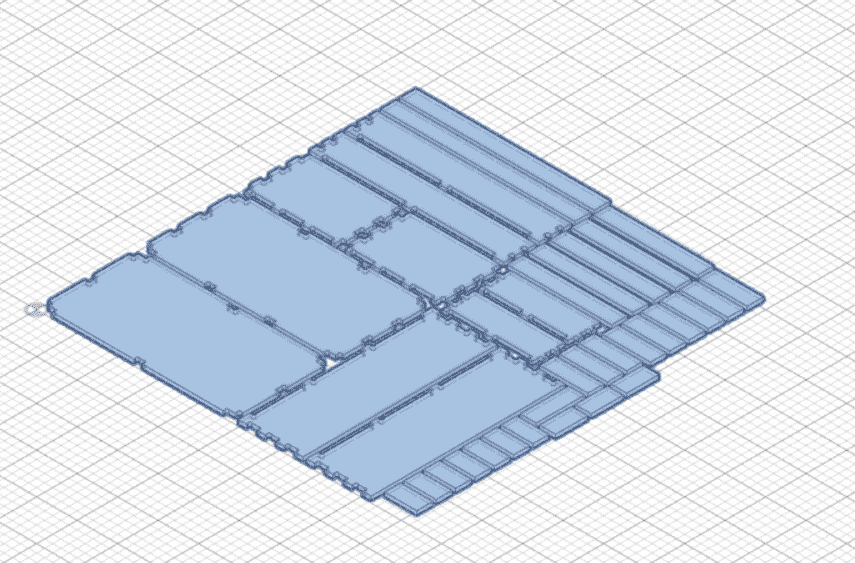

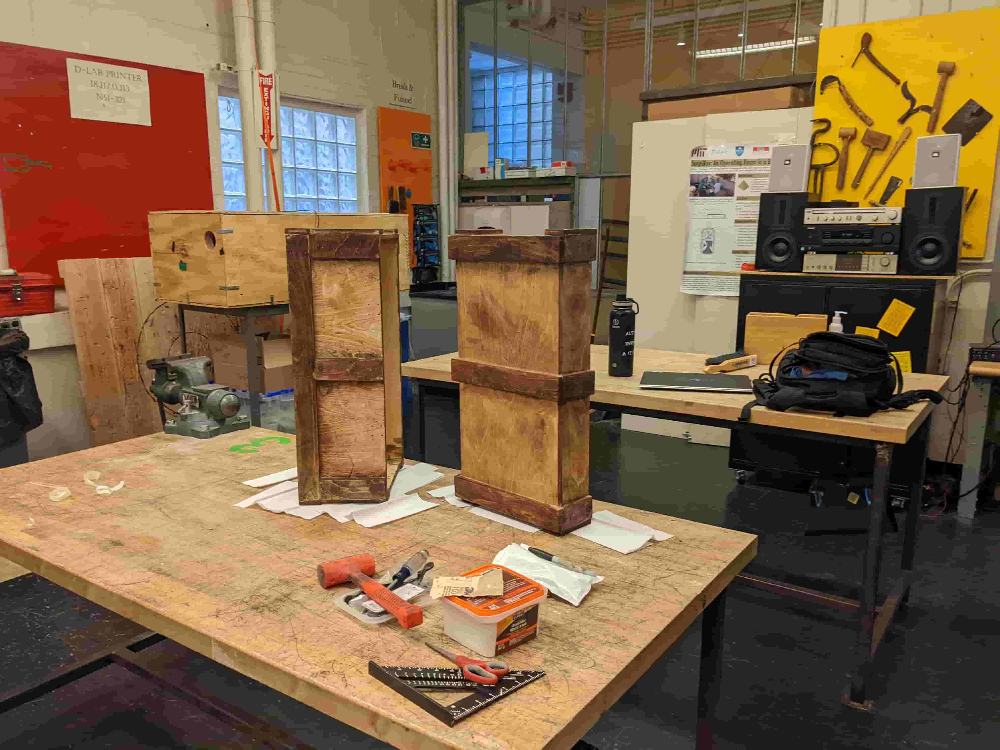

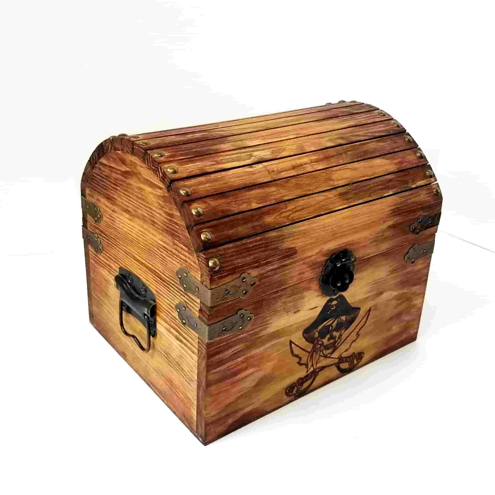

#### Week 6: CAM

- **Date**: October 13th 2022 - October 18th 2022

##### Something to store the Tressure of Ahmad Taka

Task: Make something big

For this weeks assignment I decided to take a piece of 4ft by 4ft birch plywood and make a tressure chest to store special items

#### The Design

 The start of any good project begins with the design. Because I needed to make something that had to be routed out of a thin sheet of plywood, I had to keep my design simple and able to fit within the dimensions of the sheet. However, since I do not have the mind of a super computer and cannot compute the tiling optimization in my head, to see if my 3D assembly of parts will fit within the sheet dimensions, I decided to make this the most parameterized Tressure chest known to man. I used SolidWorks to make the CAD

 Believe it or not even something as simple as a box is very annoying when making a parameterized assembly. The first thing I did to make this assembly parameterized was make an assembly sketch. This sketch is used as a base to mate parts to and use as a reference. This sketch is defined by my main parameters (height, depth, width), which in turn defines the placement and size of each component in the assembly. The cool thing about doing this method is that I don't need to define the base sketches of components I can just tie the base sketch to the main assembly sketch via the constraint solver. Basically I am designing from the top down instead of the down up. In anycase, this method proved quite effective and resulted in a very parameterized design.

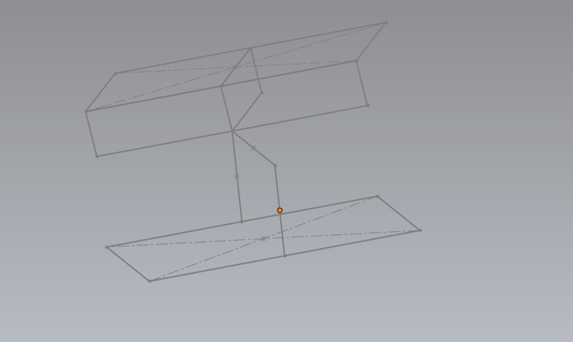

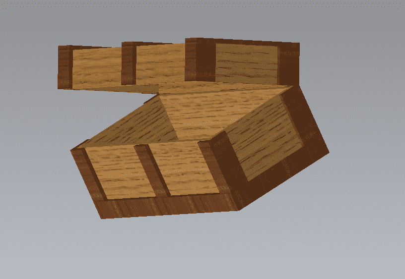

[Video: cad.mp4](../images/week06/cad.mp4)

#### Constructing the CAM

 For this part I just followed Anthony's instructions. I started by exporting my SolidWorks project as a STEP file, then uploading it into Fusion 360. Once I had my assembly in Fusion I opened the Manufacturing Workspace and made a new manufacturing model and arranged the parts on flat plane of size 47.5" by 47.5" with a spacing of 0.4". After arranging the model I began a new milling setup and put the stock size and home position relative to my parts. Next I selected a 2D contour cutting operation and put the speeds and feeds for the Mill at EDS (3/8" Flat end Mill, 12000 RPM, cutting rate of 100 in/min, and plunge rate of 40 in/min). Next I selected all the contours I wanted to cut out. Then manually place the tabs along the contour. This process largely went smoothly it just took quite some time. After that was done I generated my toolpath and everything looked good so I ran it through post processer and made my tab file. Then I sent to the mill and milled it out.

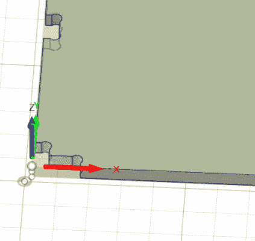

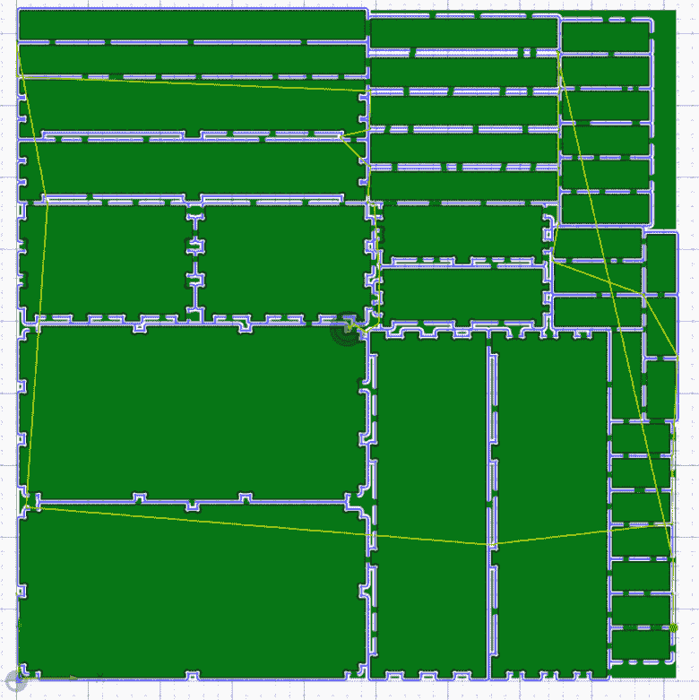

#### Post Processing

 For this part I began by crowbarring my pieces off the mill bed, then I used the bandsaw and oscillating saw to remove the tabs. I then moved all the components to my car and took it to D-Lab. Where I will sand and stain and assemble my wood.

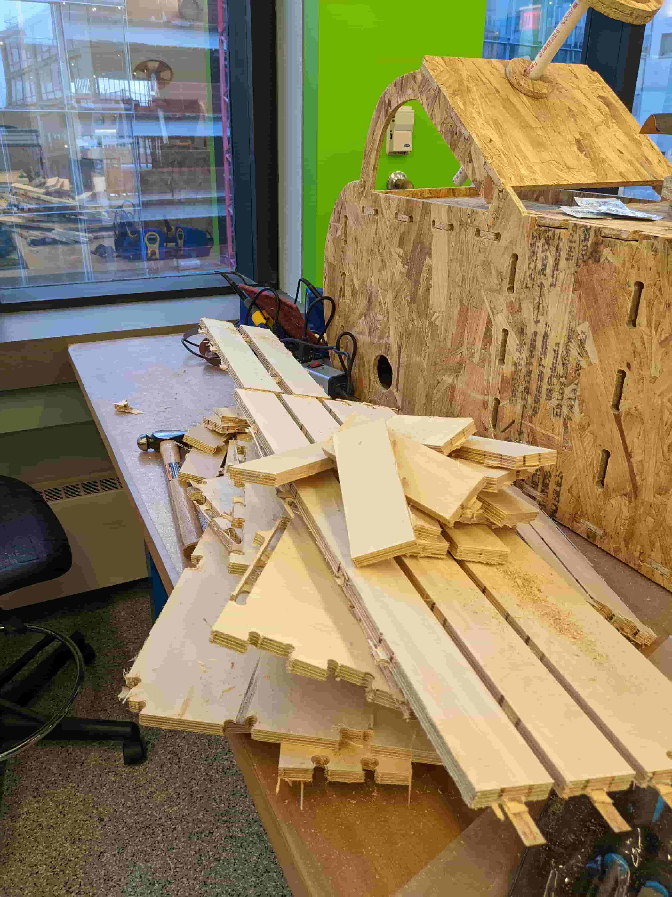

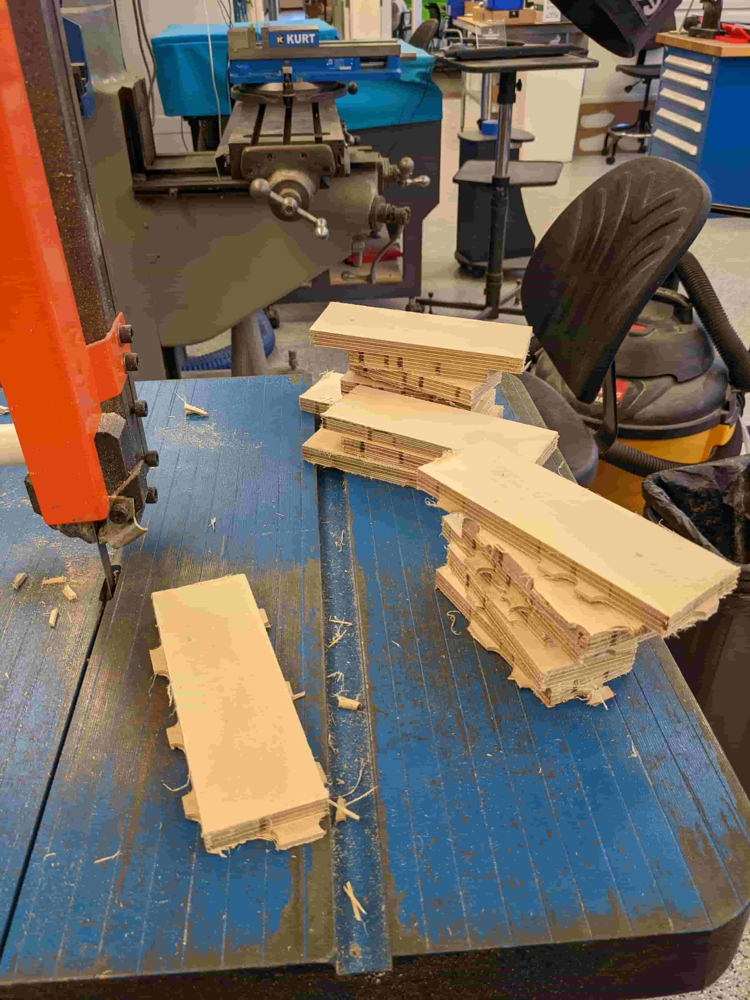

#### Sanding and Assembly

 So after milling I found that my parts didn't fit, each surface was offset by roughly 50 thousandths of inch. In order to fix this I sanded down all the surface and applied glue to keep the assembly together. I then added finishing nails along the accent pieces (dark pieces in the assembly) to give it that rustic tressure chest vibe. Once everything was put together. I did some scavenging and found a handle, hinges, and chest locks. I created pilot holes for all the additions (#8 for the handles and hinges and #6 for the locks). For the sanding I went from 80 grit to 240 grit to get the finish you see.

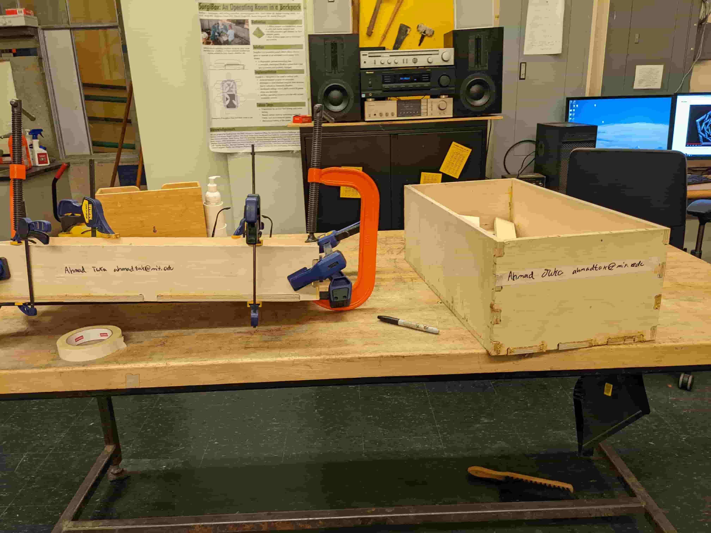

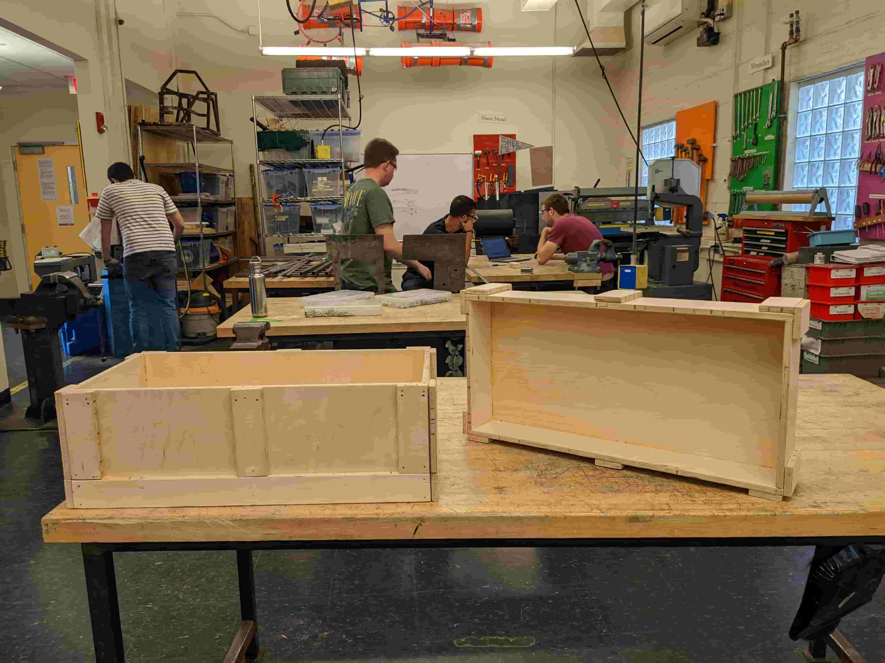

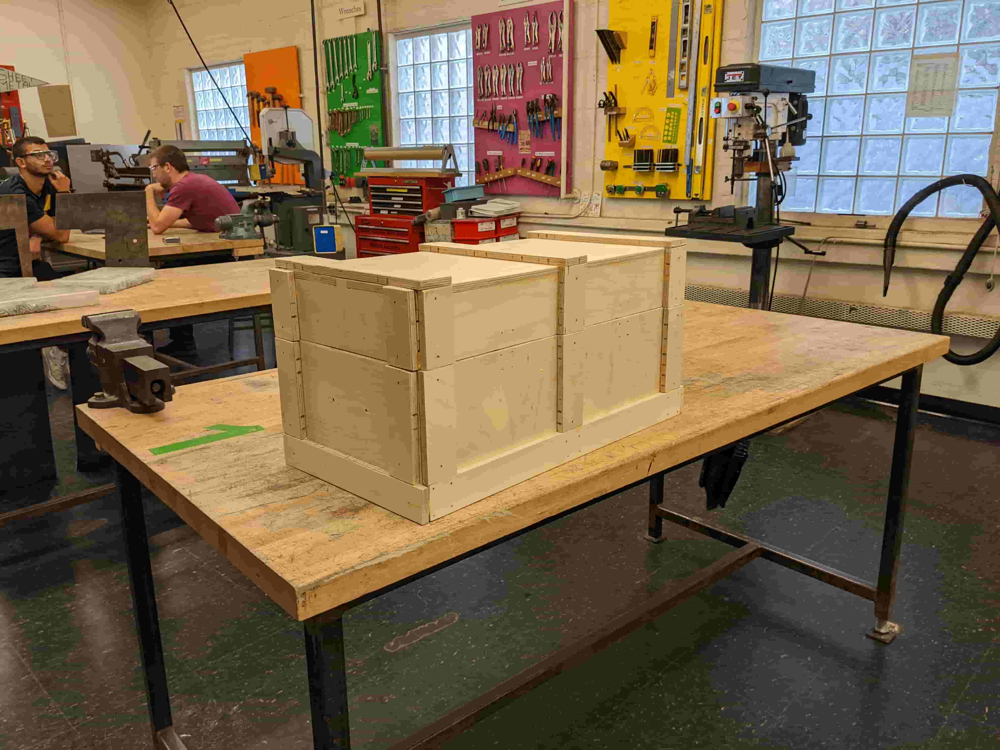

#### Staining the Wood

 Once I had the cover and main body fully assembled and sanded. I went to the fume hood and began staining the wood. For the interior I used a natural stain and for the exterior I did a combination of dark stain and light red cedar stain. I used the dark on the accent pieces and cedar on the main panels, however there was a lot of cross contamination. After I stained the wood I left it to dry for a while and then came back to put everything together one last time.

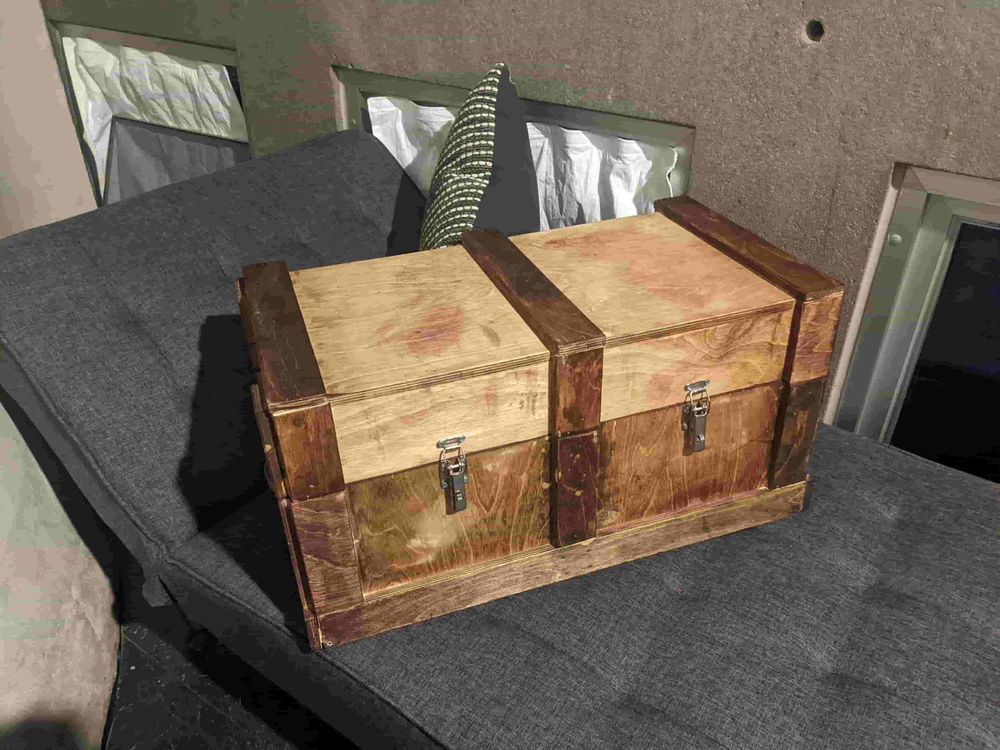
