# Week 7: embedded programming (MIT How to Make (Almost) Anything, fall 2022)

_Converted from Ahmad's class documentation page (`menya_project/archive/menya_how_to_make/people/Ahmad/page/week-7-details.html`)._

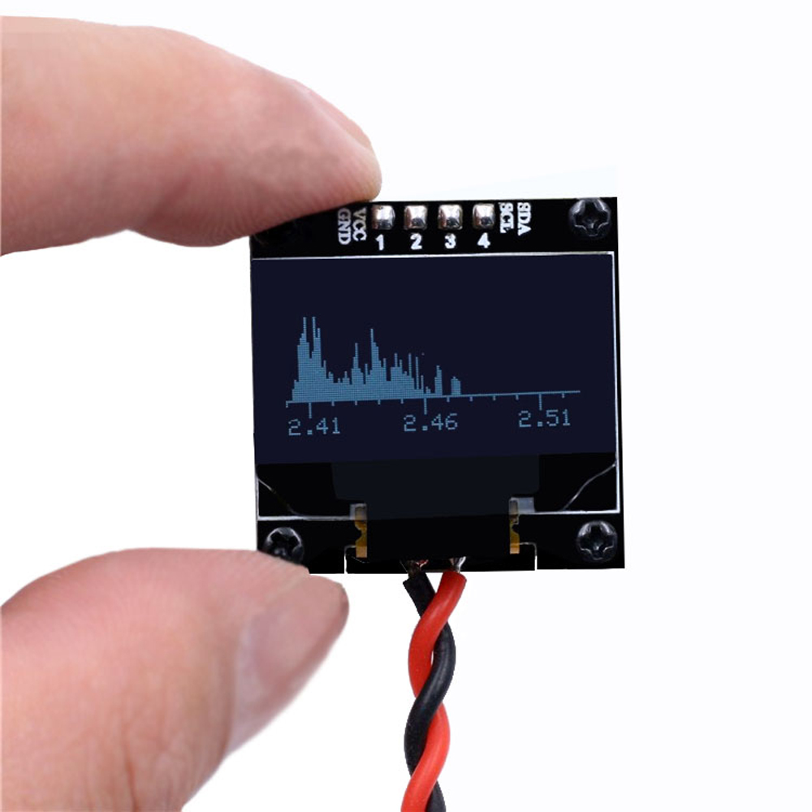

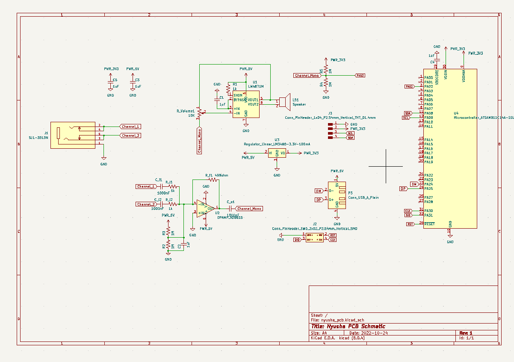

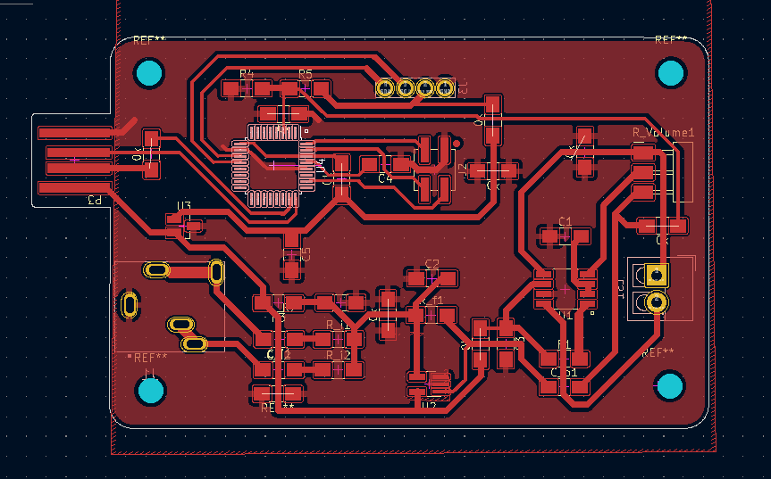

#### Week 7: Embedded Programming

- **Date**: October 19th 2022 - October 26th 2022

##### Taka Spectrum Analyzer/Audio Output

Task: Make a board do Something

For this weeks assignment I decided to attempt making a Spectrum Analyzer and Audio Amplifier

#### Main Schematic

 In order to design my circuit I first sat down and set my design rules.
 1. I want to be able to hear the music at least louder than my phone
 2. I want to see the real time frequency spectrum of my audio

 After analyzing the datasheets of the SAMD21E (MCU), LM4781 (Amplifier ), and AD615 (Op-amp), I came up with a Schematic that met all my design criteria. I breakdown each submodule of my design below.

#### Audio Amplifier

 For the audio amplifier, I am using the LM4781 and controlling the input volume with a 10K potentiometer. This is a class AB amplifier which means that this IC applies both a voltage and current gain to my input signal. It is able to do this at ~80% efficiency, which means relatively little power is being used up by the IC compared to the speaker. It is capable of delivering up to 3W to a 4 Ohm speaker and 1.5 W to an 8 Ohm speaker (which is what I have).

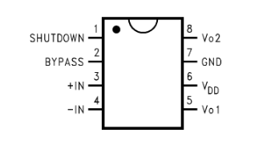

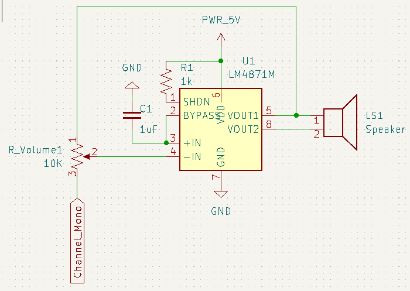

#### Audio Mixer

 This module is in charge of taking the analog stereo input and converting it to mono output. Basically I need two take two analog inputs and add them togethers. To do this I made an analog adder using op-amps. This is a very common circuit and can be easily found with countless tutorials online ([here](https://www.electronics-tutorial.net/analog-integrated-circuits/op-amp-adder/)). I added a voltage bias so that my output signal was centered around 2.5 V and not 0V. I also added to capacitors on the input which then makes this circuit an active high pass filter ([here](https://www.electronics-tutorials.ws/filter/filter_6.html)). This output then gets fed into the Audio Amplifier.

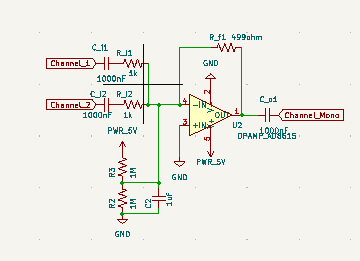

 Once I had completed my design and had it vetted by Anthony and Alec (and also simulated some of it in circuit JS), I routed my traces and came up with a manageable pcb layout. Afterwards, I generated my gerber files and began milling out my board. This went smoothly. I then began soldering everything for the audio amplifier and mixer to see if it would work.

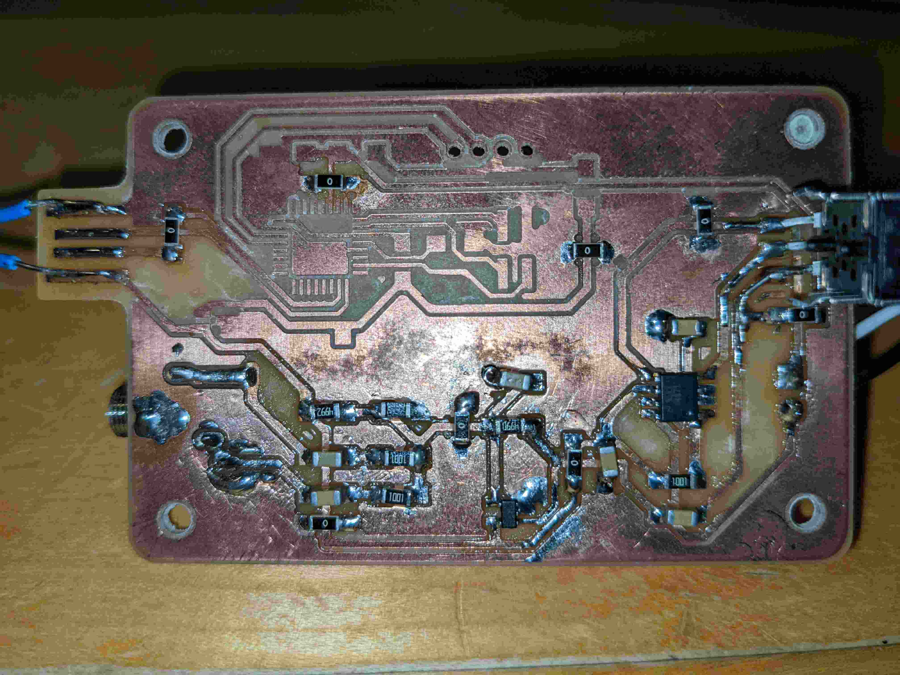

#### Debugging

 My good luck has officially run out. something went terribly wrong. My Audio amplifier and mixer would simply not work. I checked for shorts and also used the multimeter to check that each IC was getting voltage correctly; there were no shorts and each IC was getting voltage. When I checked with the scope things got really weird. I would measure my audio signal and measuring from the aux I got a clean signal then measuring from the connector I would get a lot of noise. Furthermore, even though there was a signal on the speaker output It was a mystery as to why that output wasn't driving the speaker. I tried wiring the speaker in reverse and that did nothing. I was completely dumbfounded.

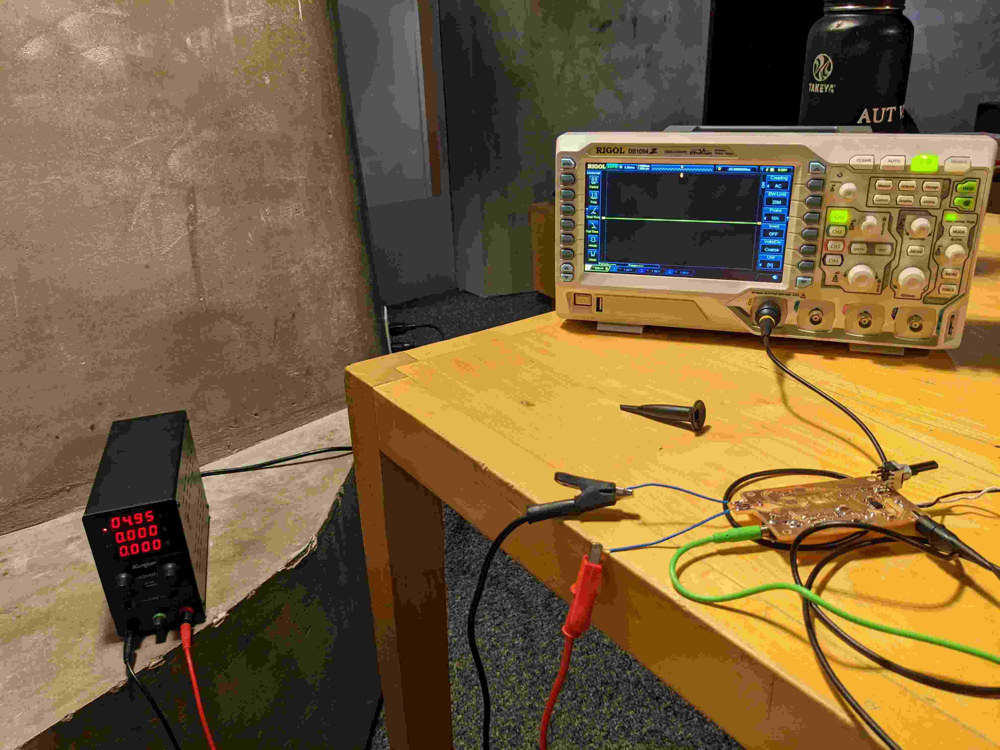

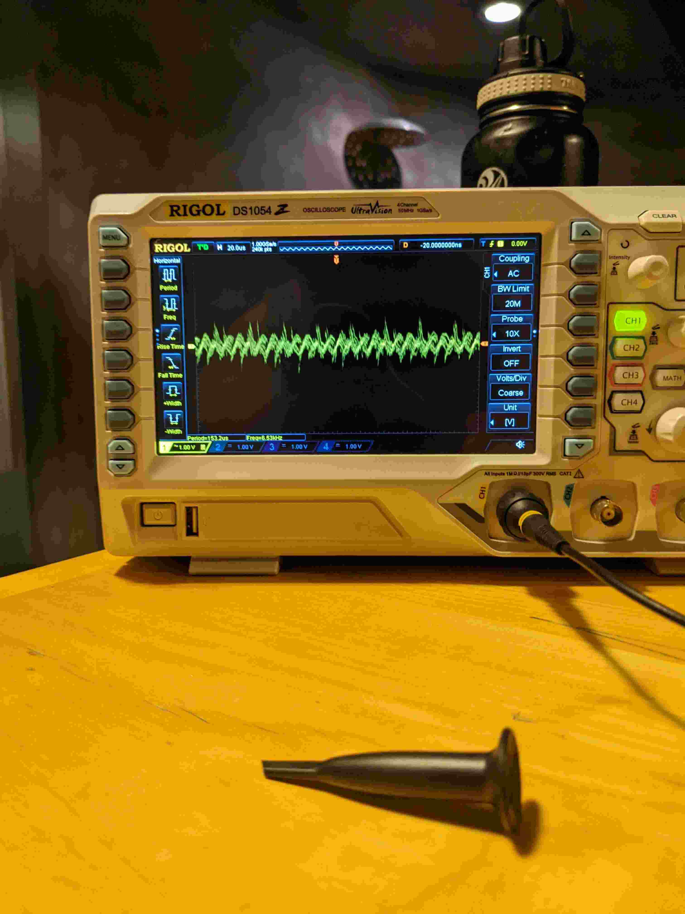

#### Regrouping

 After I lost the battle for the week to this PCB, I decided to regroup and plan a coordinated attack. I realized that I was trying to do too much all at once. I needed to work in circles. For this week all I needed to do was program a board to do something. I decided to develop and easy breakout board and program that to drive an led screen matrix I obtained from EDS. This is the first circle in my audio amplifier/spectrum analyzer board which will go towards my final project. For this plan to work I first needed to design my breakout board and make sure it can work.

#### Break-Out

 For the break-out I wanted something super simple. A board that was easy to make and contained a status LED for indicating if power was getting to the board. I quickly routed it out and milled it. It was very good that I did this cause the milling failed the first time, which is fine cause it takes five minutes to mill out. Once it was milled I soldered the components and checked for shorts. I was all good. I powered the board and programmed a simple HelloWorld print to serial, using an FTDI programmer.

 [Download Hello World Code](../images/week07/HelloWorld.ino)

#### Display MAX7219

 I wanted to display my FFT/Waveform on a sizeable screen, and drive it via the ATTiny. OLED screens were too small and bigger ones were just tv displays. The MAX7219 seemed like the way to go it was just the right size and could was quite versatile. This display could be driven using the u8g2 library which has extensive [documentation](https://github.com/olikraus/u8g2). In order to get the credit for this week I read the documentation and wrote a simple script using the documentation and my breadboard to display some text. The display (MAX7219) communicates using a serial protocol without using the MOSI pin on the ATTiny1614. I hooked it up on the breadboard (schematic on the right) and programmed it using my code to display text.

 [Download Simple Text Code](../images/week07/Test_Screen.ino)

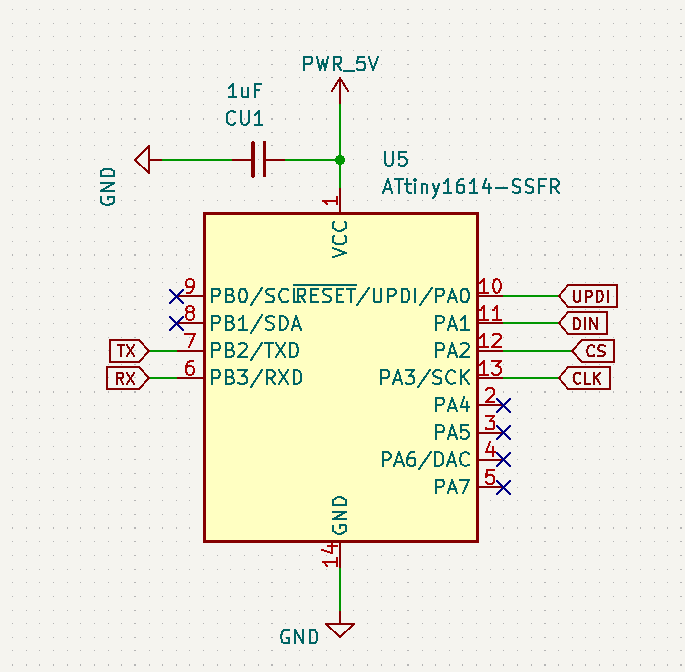

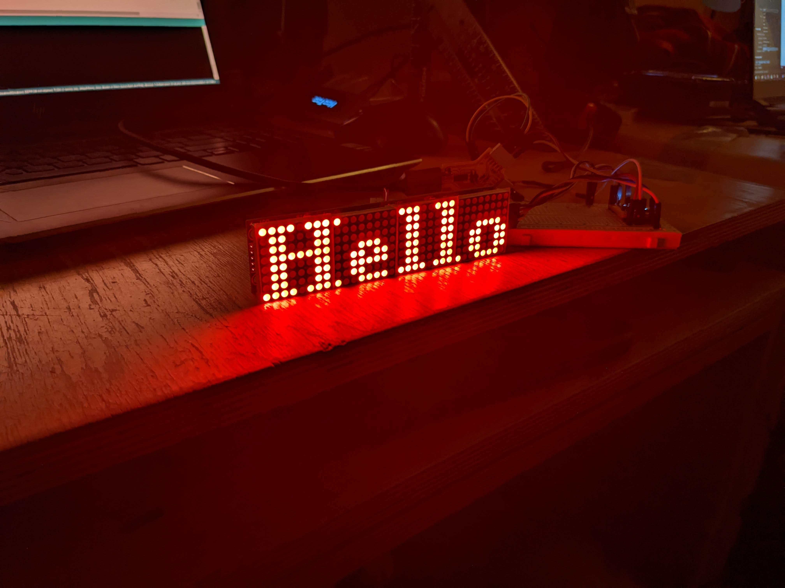
