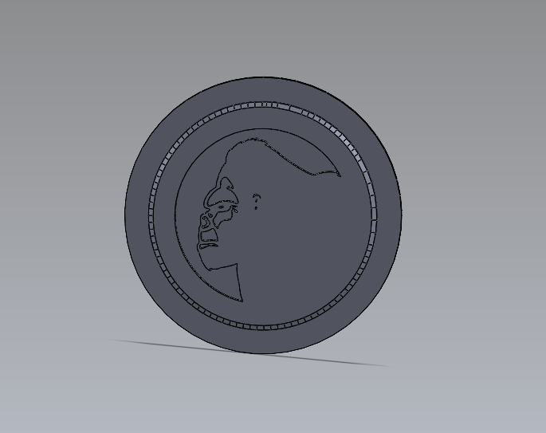
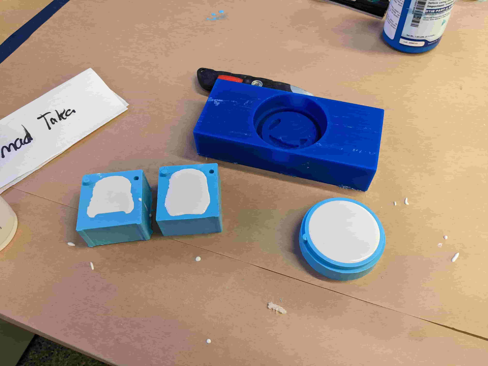
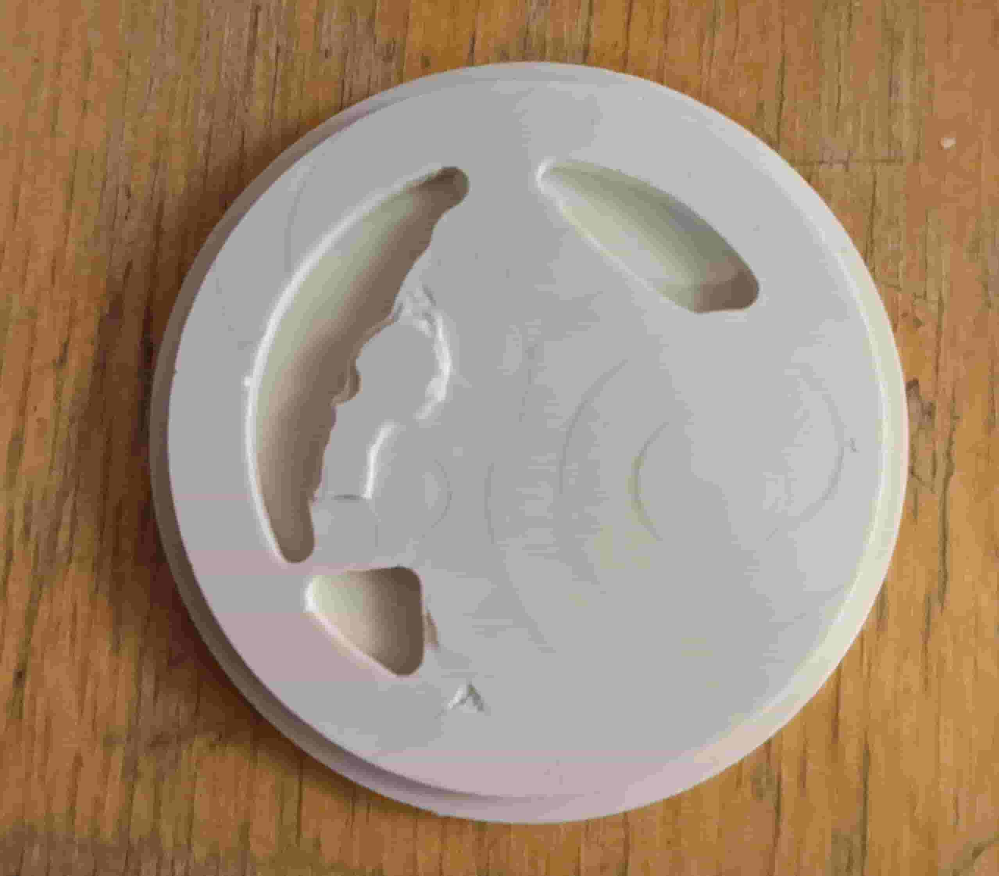
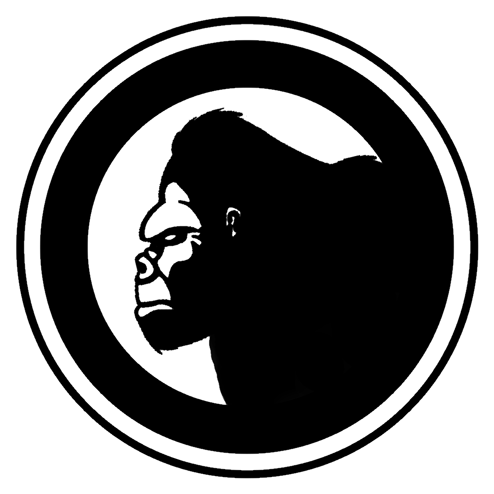
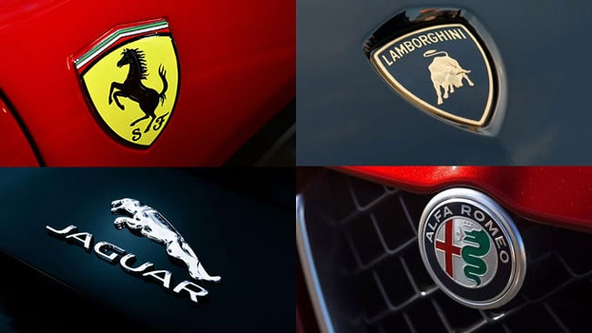
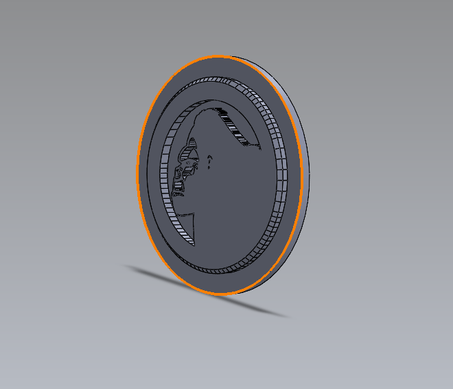
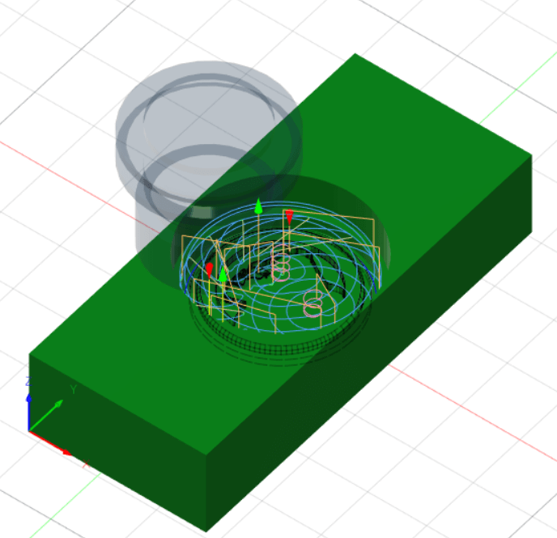
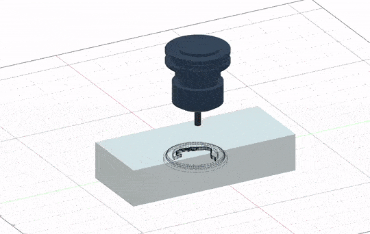
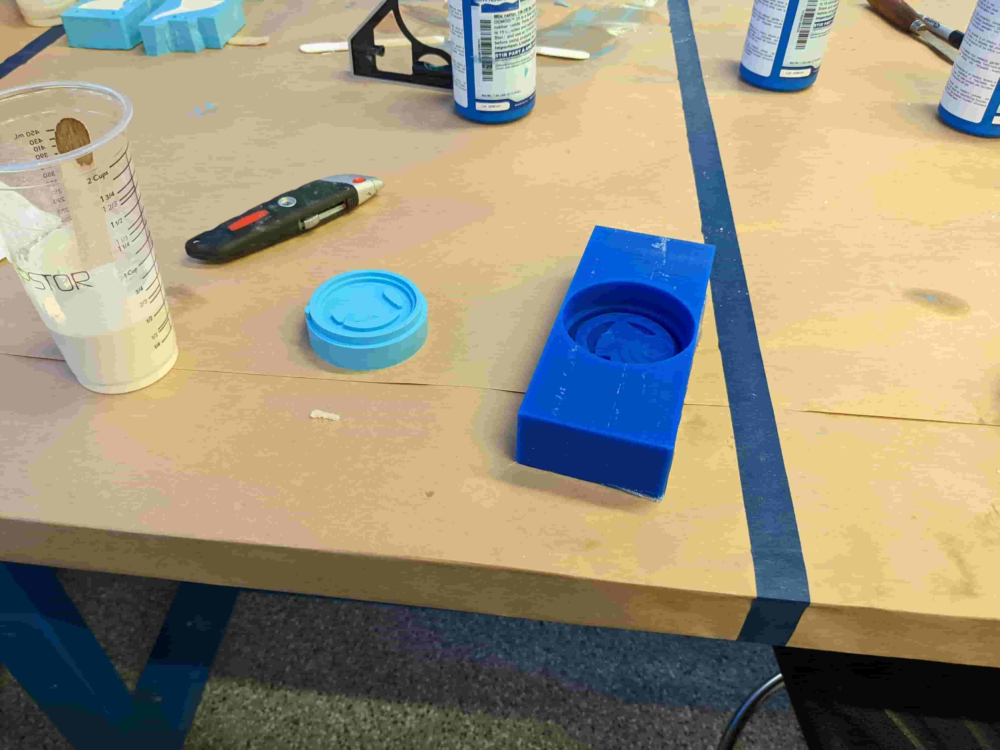

# Week 8: molding and casting (MIT How to Make (Almost) Anything, fall 2022)

_Converted from Ahmad's class documentation page (`menya_project/archive/menya_how_to_make/people/Ahmad/page/week-8-details.html`)._

#### Week 8: Molding and Casting

- **Date**: October 27th 2022 - November 2nd 2022

##### Final Project Emblem

Task: Make a mold and cast something

For this weeks assignment I decided to take a relaxing break and make an emblem for our final project

#### The Logo

 Many companies name cars after animals. Cars like the fiat panda, shelby colt, rams, and jaguars all have some relation to animals. Since these cars are all great and very menacing, obviously our vehicle needs some relation to an actual animal. After doing some googling I found that, my favorite animal, a gorilla is not on a notable car. And simply buy coincidence my friend groups logo is that of a gorilla. As a result for this week I decided to make an emblem version of our logo.

#### Designing the Emblem

 So obviously some of the details on our logo could not be casted. However, since it was fun to cad and any details it couldn't I could either correct later manually or just ignore so it looks generally ok. So I decided to eliminate the ears and the outer circle. I extruded the remaining sketch and also extruded the smaller details. Finally I found the center of the logo and extruded a small circular base total thickness was 10 mm (1 cm). I designed this using SolidWorks 2021.

#### Designing the Mold

 Once I had my emblem design in SolidWorks, I exported it as a Step file and then imported into fusion. I then opened the manufacture view in fusion and began setting my cam. First I made my setup by picking my stock size (1.5" by 7" by 3"). I set the origin to the bottom of the stock, because that is where we will be homing. After getting my setup, I began my CAM operations. I first started with 3D adaptive clearing with 0.25" flat end mill, then I did a contouring and flattening operation with 0.125" flat end mill. For each operation I ran the spindle at 18 KRPM.

#### Making the Mold and Casting

 For the mold I used Oomoo which is a silicone based material. Oomoo gives me multiple materials options. In order to make the mold I first measured how much Oomoo I will need by filling my wax mold with water and measured the amount of water. Then I mixed part A and part B of the Oomoo and poured it into the wax mold. After the mold dried it was time for me to pick my material. I liked the texture of dry stone, so I decided to cast using drystone. The ratio of water to drystone powder by weight is 1 to 5. I mixed the drystone powder and water got drystone liquid and then poured it into my Oomoo mold.

