# Week 9: input devices (MIT How to Make (Almost) Anything, fall 2022)

_Converted from Ahmad's class documentation page (`menya_project/archive/menya_how_to_make/people/Ahmad/page/week-9-details.html`)._

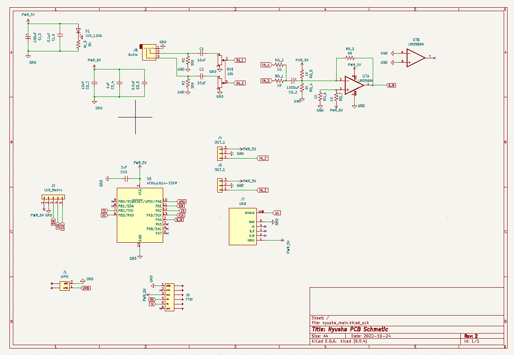

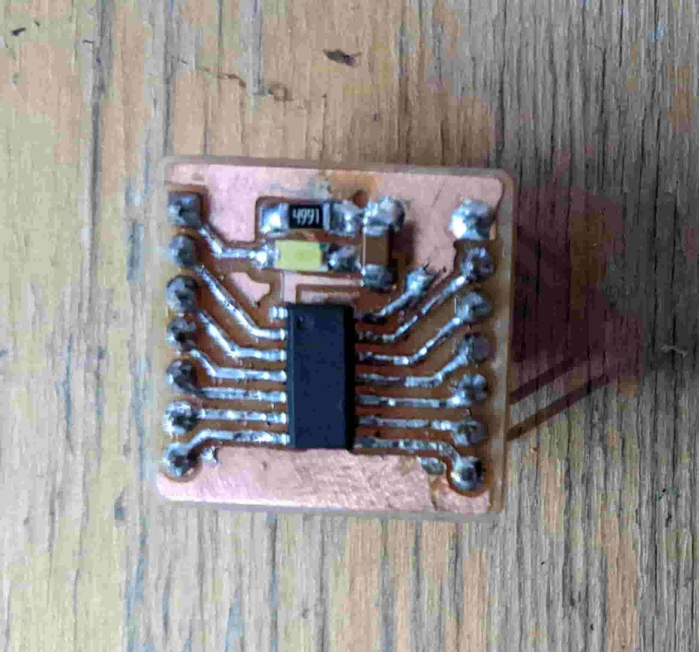

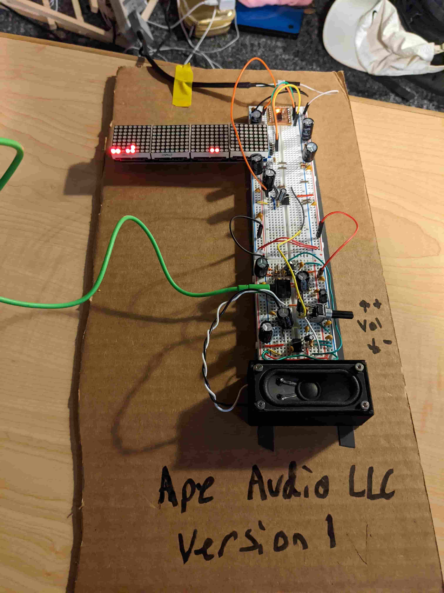

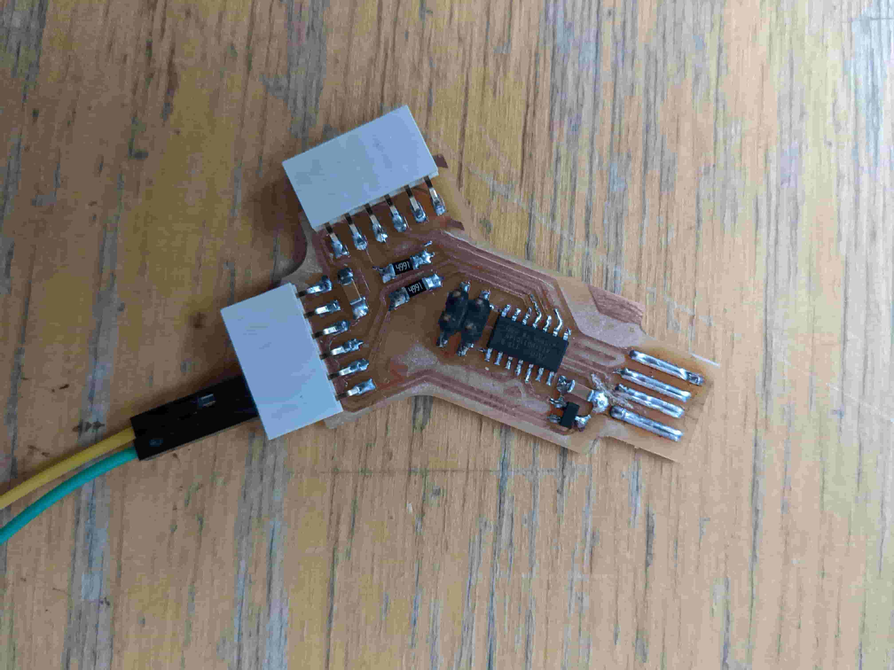

#### Week 9: Input Devices

- **Date**: November 2nd 2022 - November 9th 2022

##### Audio Mixer/Input for waveform display

Task: Make something that takes input

For this weeks assignment I decided to continue my spectrum analyzer/ audio amplifier circuit by making an audio mixer for inputting stereo

#### The Design

 Because this will be used in conjunction with my audio amplifier and also handle much of the spectrum analyzer computation. I decided to design it more like a motherboard with special functions. So for input it has UPDI, two audio channels (stereo), potentiometer for volume control, and power (micro-usb port). For outputs it must have a display (SPI), serial (FTDI) and power to the audio amplifiers.

#### The Raw Input

 Processing Audio is very complex and there are a lot of ways to do it. Because I wanted my initial input to be volume controlled with a potentiometer, and potentiometers tend to respond poorly to high frequency noise, I added a high pass filter on the input. This also has the added benefit of protecting my phone. The output of the filter then goes through a dual 10K potentiometer which acts as a voltage divider. This allows me to scale the input voltage which in turn will scale the output on the audio, resulting in volume control.

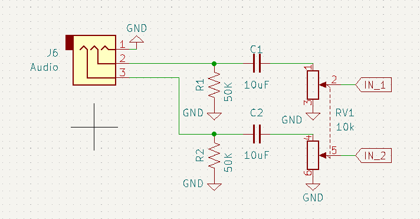

#### Mixer

 For the audio mixer and input to the microcontroller, I implemented a simple analog signal adder. This afforded me a few benefits. First it allows me to amplify the input signal so the microcontroller's ADC could be sensitive to the incoming audio. It also buffers the microcontroller input pin from the rest of my circuitry, creating better isolation. Lastly, due to the fact op-amps have high input impedance, I don't have to worry about my detection circuit diverting too much power from my speaker load. I added to biased both inputs so I could use a ground reference voltage instead of a negative supply.

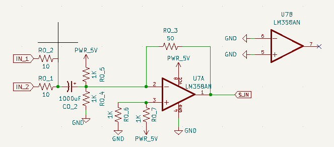

#### Digital Logic

 The last component is the digital side. I wanted the MCU to take in audio from the op-amp signal adder and output to an SPI LED display (MAX7219 display). In addition, I wanted ports for programming (UPDI) and debugging (FTDI). Putting all this together I created the next section of my schematic. I used PA4 for the audio signal input.

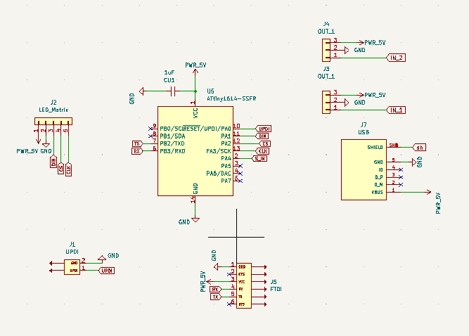

#### Full System

 Putting all this together, I layed out my full schematic. After laying it out I routed my traces and created the footprint. Since this is just the input/motherboard of my full design (continued next week). I had to take into account how the audio amplifiers would be connected. I designed it such that all the pcb's together would form a cub, with the mother board being the base of the cube. This both looks cool and makes everything neatly packaged.

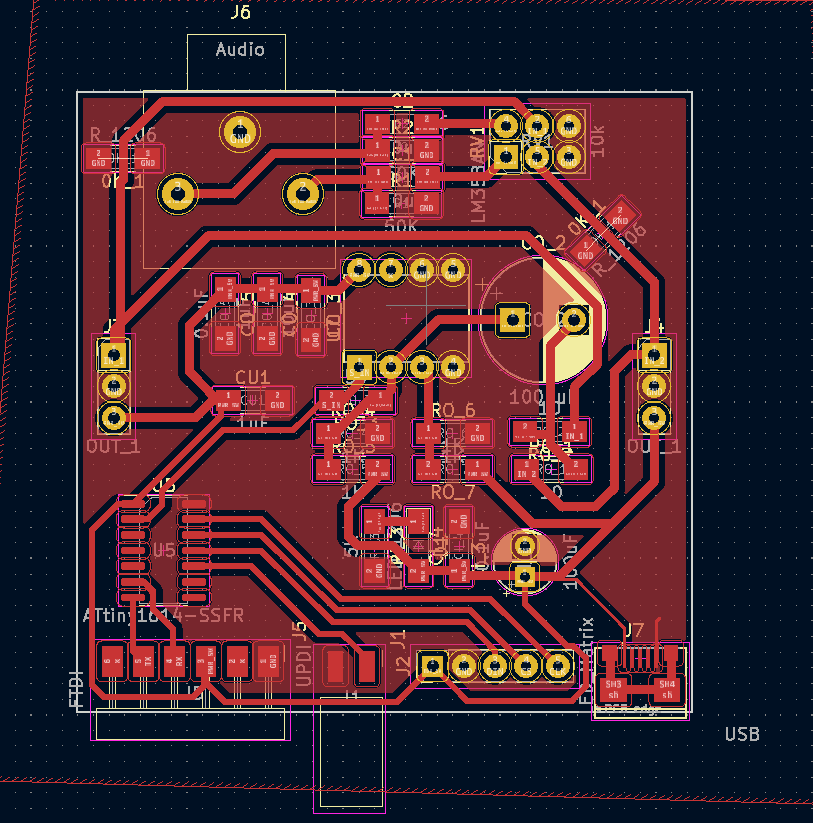

#### Making Dev Boards

 Because I didn't feel like routing out the full board and watching it inevitably fail (As it has done so many times in the past). I saved myself future stress and headache, and created some break-out boards so I can test my circuit on a breadboard before I mill it out. I started by making a tiny breakout for the ATtiny1614. Not only do I meet the design requirement for the week, but its easier to replace one tiny board that takes 5 minutes to mill, rather than replace my main design. I added an LED to indicate that power was being delivered and a bypass capacitor to stabilize the input voltage. In order to program my dev board and debug, I made Quentin's dual serial FTDI programmer ([here](http://fabacademy.org/2020/labs/ulb/students/quentin-bolsee/projects/dual_serial/#firmware_1))

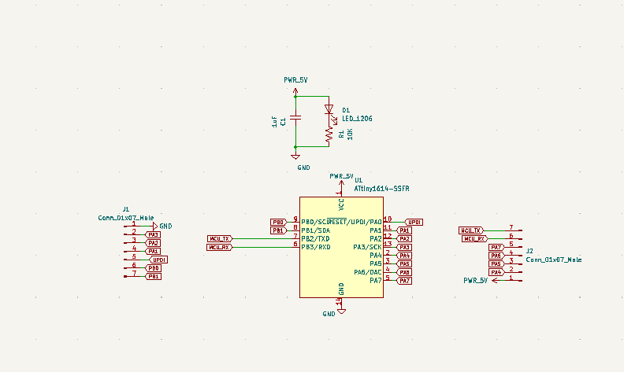

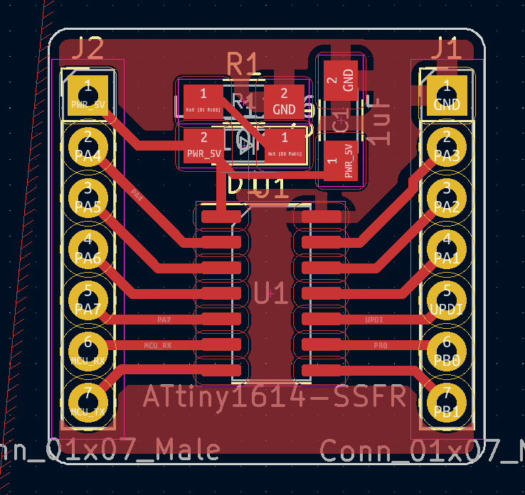

#### Testing on a Breadboard

 This way was definitely very smart cause I went through two MCU break-outs and LED screen making this design. I took my schematic split it in half (only doing mono instead of stereo) and put the full thing on a breadboard. I even had time to put the speaker on the breadboard. Testing it out on the breadboard allowed to me to change components quickly and fix noise straight on the source making a very clear sounding cheap amplifier. I added a bunch of bypass capacitors closer to the ICs, found the perfect resistor sizes for the op-amp adder. And was able to rapidly test my code.

[Video: breadboard.mp4](../images/week09/breadboard.mp4)

#### Next Steps

 Although, I didn't have enough time to solder the main speaker board. I did have enough time to mill it out. The next evolutions of this project will be to make it bluetooth compatible, add the second channel making it full stereo, design a 3D printed case, and manufacture the audio amplifiers.

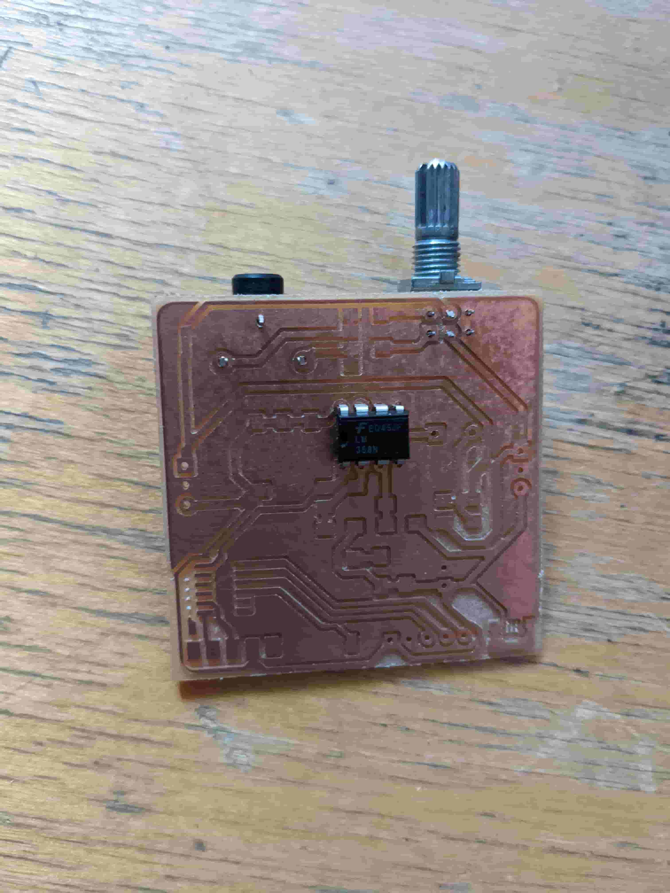

