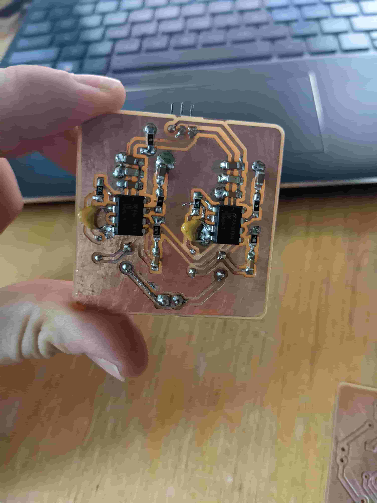
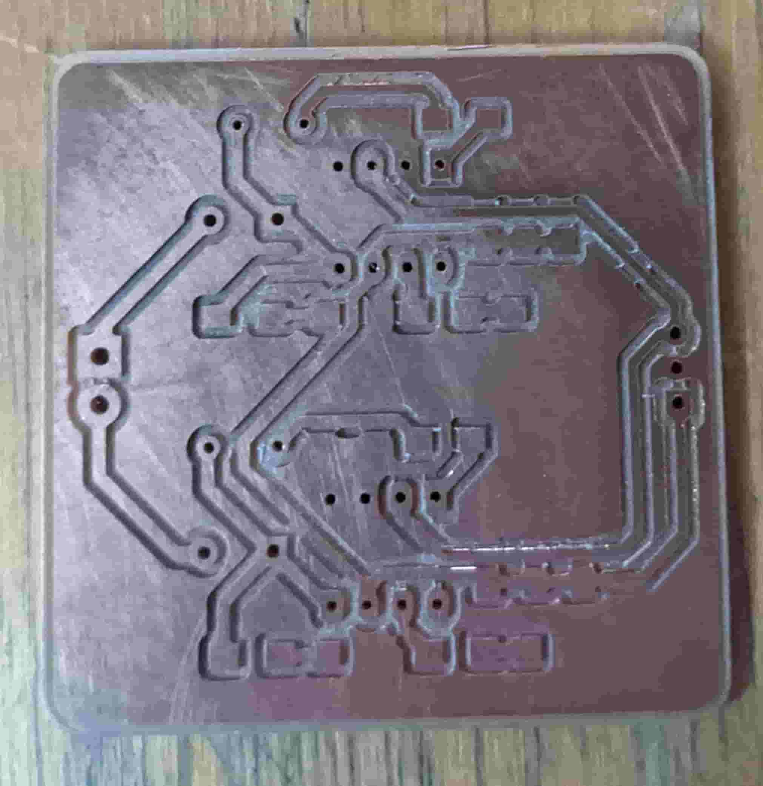
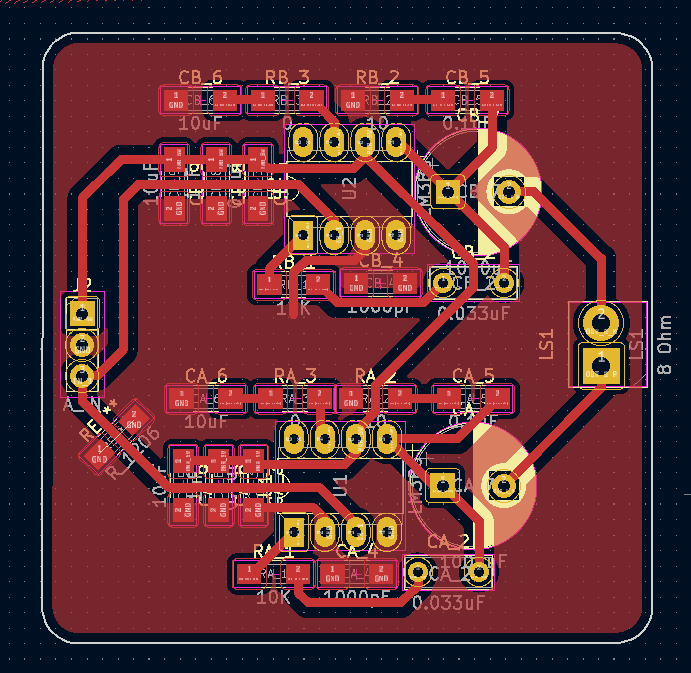
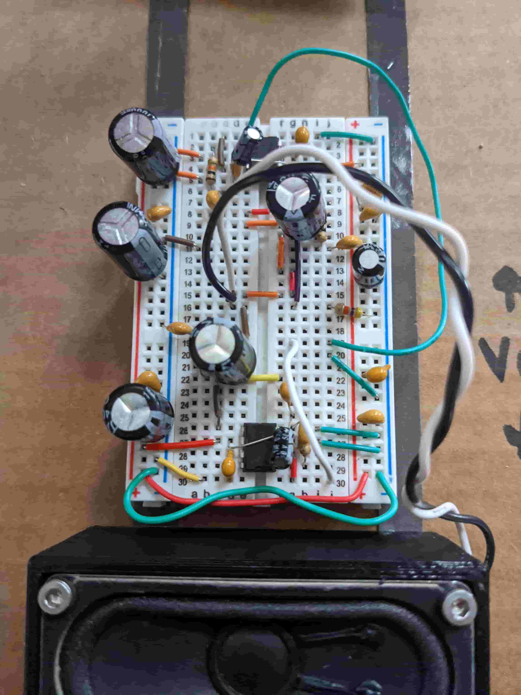
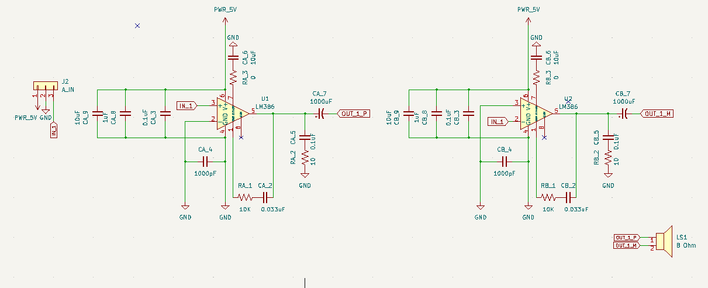
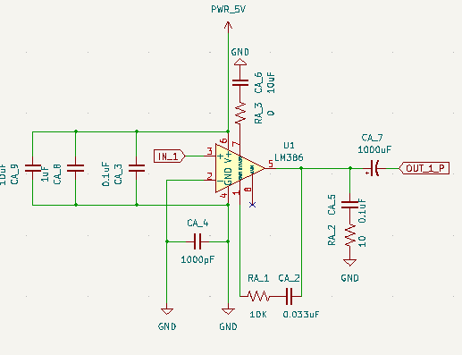

# Week 10: output devices (MIT How to Make (Almost) Anything, fall 2022)

_Converted from Ahmad's class documentation page (`menya_project/archive/menya_how_to_make/people/Ahmad/page/week-10-details.html`)._

#### Week 10: Output Devices

- **Date**: November 9th 2022 - November 16th 2022

##### Audio Amplification for speaker output

Task: Make something that takes input

For this weeks assignment I decided to continue my spectrum analyzer/ audio amplifier circuit by adding speakers to it.

#### The Design

 For this week I wanted to make my own audio amplification board, that interfaced directly with my main board from last week. I wanted to be able to push at least 2W through an 8 Ohm speaker. I also wanted to use the LM386 cause it was very easy to use and past experience with LM4781 has shown to be very annoying. After reading the [datasheet](https://www.ti.com/lit/gpn/lm386) and discovering something called a bridged amplifier configuration, I came up with my own schematic for a very loud (for an LM386) audio amplifier.

#### Audio Amplifier

 So to simplify this explanation and make it more clear I will only focus on one unit of it (half of the bridge configuration). All the bridge configuration means is that the input signal gets inverted by sending it to the inverting input of the lm386 and then added to the amplification by adding the output to the negative side of the speaker.

 So the first thing to know about using the LM386 amplifier is that it is very sensitive to noise. This is why you need to be very careful of how you place bypass capacitors. I went with the overkill solution of bypass caps and put 3 on each IC (CA_3, CA_8, CA_9) each of different values. Next I made sure to add another capacitor between the grounded input and the actual ground rail (pins 2 and 4). This may seem like it does nothing but it acts as a means to prevent radio frequencies from interfering with the IC (which is why its in the pico farad range). Next is the bypass cap for pin 7, this comes from the datasheet. It is there to stabilize amplification circuitry in the chip. Next we have bass boost (pins 1 to 5), this makes the audio output sound very very nice. finally, we have two output filters a lowpass filter and a highpass filter.

#### Breadboard Testing

 Before making this on an actual PCB, I decided to test my circuitry on a breadboard. This helped me visualize whats happening and also see what the audio would sound like and if I could improve it somehow. This was a very good idea, I found the source of a lot of noise and plugged it with capacitors and other things. This allowed me to refine my design and use better values for my capacitors and resistors.

#### Layout and Milling

 I wanted the board to fit in a small area and interface with the board from last week. I made it 50 mm by 50 mm. It takes 3 inputs (power, ground, and audio input), see last weeks documentation for more detail on this. I used big thick traces and made everything easy to solder. I routed my traces and created the footprint.

#### Assembly and Debugging

 After routing my traces I milled out my board. This was very annoying! The initial board after it came out of the mill had a lot of problems, that I couldn't see. It was only after soldering all the components and finding short after short then removing the components, did I realize that the mill really messed up and left a bunch of small copper jumpers all over my board that I did not see. I resoldered the whole thing twice and still found out that there was another short between the audio input and ground. After trying to fix the issue and all the resoldering I decided to scrap the board. Meet the requirement this week by using the breadboard amplifier.

#### We Have Audio

[Video: speakers-audio.mp4](../images/final_project/electronics-design/speakers-audio.mp4)

#### Next Steps

 The next evolutions of this project will be to make it bluetooth compatible, add the second channel making it full stereo, design a 3D printed case, and deal with abundance of noise.

