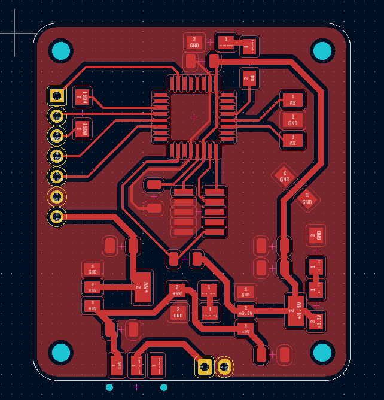
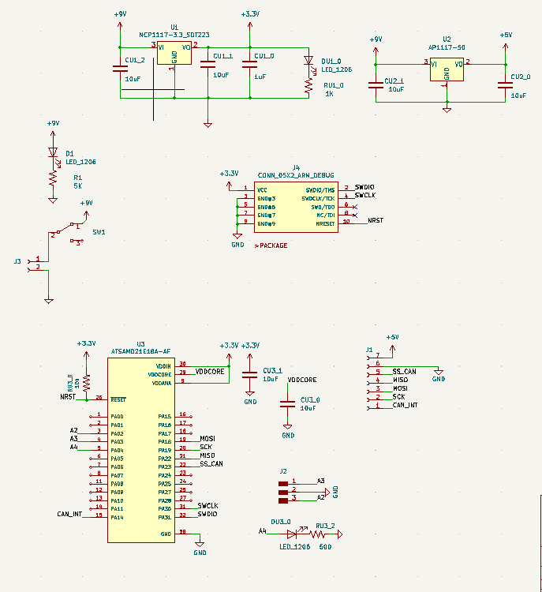

# Week 11: networking (MIT How to Make (Almost) Anything, fall 2022)

_Converted from Ahmad's class documentation page (`menya_project/archive/menya_how_to_make/people/Ahmad/page/week-11-details.html`)._

#### Week 11: Networking

- **Date**: November 16th 2022 - November 23rd 2022

##### CAN bus testing

Task: Make something that communicates

For this weeks assignment I wanted to play around with CAN transceivers. This is so I can get familiarity with CAN for future projects and my final project

#### The Design

 For this week I didn't have too much time for debugging, so I decided to take it light and make a PCB that gives me some insight into how CAN communication works. I just wanted one board to turn on an LED on a second board using CAN communication. I also wanted this PCB to be powered off of a 9V battery to make this experiment portable. In addition I wanted to be able to turn my board on and switch it off. After getting my schematic in I routed all my traces and made a simple board layout. For the microcontroller I needed something that would compile the [library](https://github.com/autowp/arduino-mcp2515/blob/master/mcp2515.cpp) for the transceiver, which I bought off of [amazon](https://www.amazon.com/Comidox-MCP2515-Receiver-Controller-Development/dp/B07J9KZ4L4/ref=sr_1_3?crid=V4I0S3H7BCLP&keywords=mcp2515&qid=1669170664&sprefix=mcp2515%2Caps%2C64&sr=8-3). The transceiver was designed to communicate with MCU's using SPI. This makes it great for Arduino and DIY projects. The library is also SAMD compatible, making it perfect for a relaxing week.

 After getting the schematic done I layed out my board and routed all the traces. It came out in a nice 40mm by 45mm form factor.

#### Assembly

 Because I wanted to relax more I decided to film a nice 3 hr relaxing timelapse. Here you can see me solder all the components I started with the smaller pitch components and went up. I made sure to check everything for shorts. You can see me doing this with a multimeter and using the microscope. I was able to find and fix them. I also practiced with the soldering wick to make things look cleaner.

[Video: soldering.mp4](../images/week11/soldering.mp4)

#### Programming

 This part was relatively simple, I only had one major bug. I wrote two firmwares for this week. The sender sends frames on the CAN bus at a rate of 125kbs, sending 2 frames every second and flashes an LED everytime it sends a frame. The second if it receives a frame with no error message it will simply turn on an LED. There isn't much going on with this code it was just meant to be a first circle in my exploration of CAN. Although there wasn't much this was still fun to make and see work.

 [Download Sender Code](../images/week11/khan_reciever_firmware.ino)

 [Download Receiver Code](../images/week11/khan_sender_firmware.ino)

[Video: working.mp4](../images/week11/working.mp4)

#### Next Steps

 For the next steps of this project I want to be able to create a multi-node network of CAN transceiver all hooked on the same line this will give me the ability to communicate over distances with somewhat high noise.
