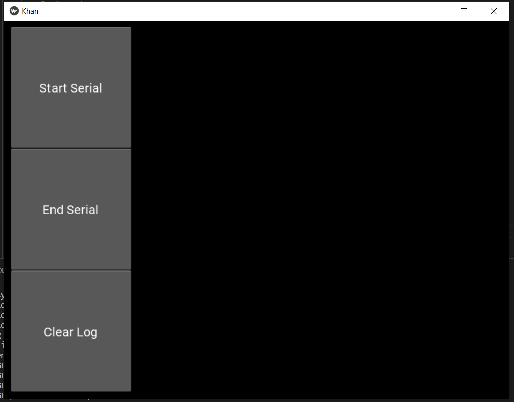
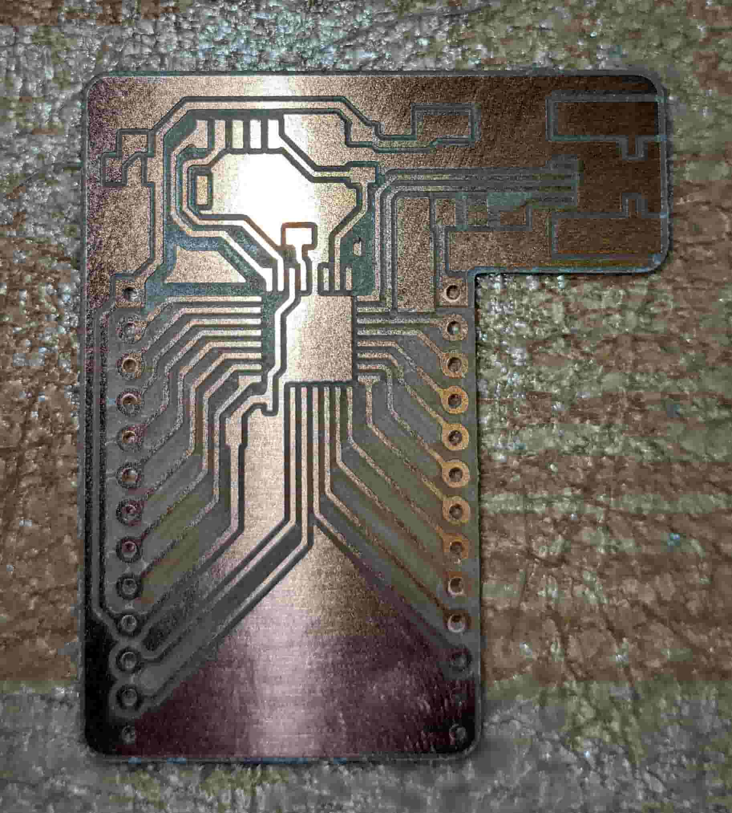
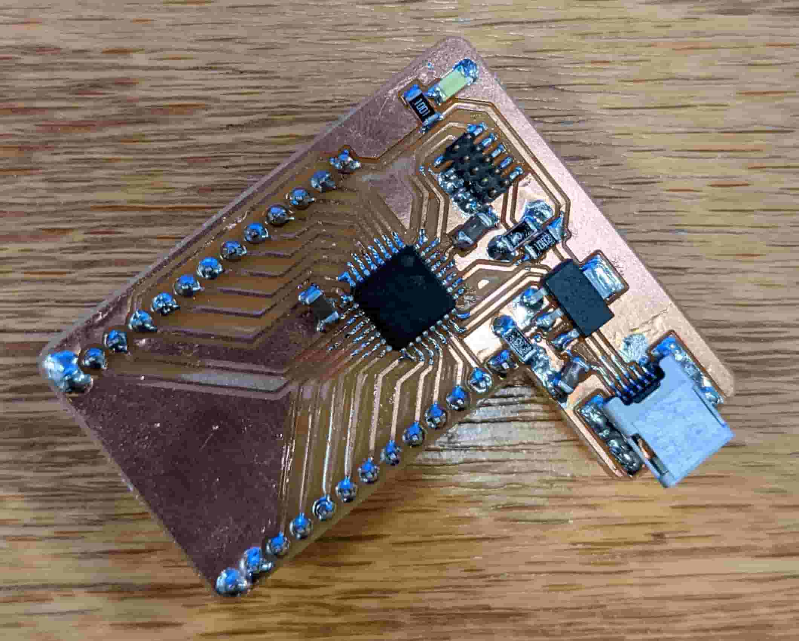
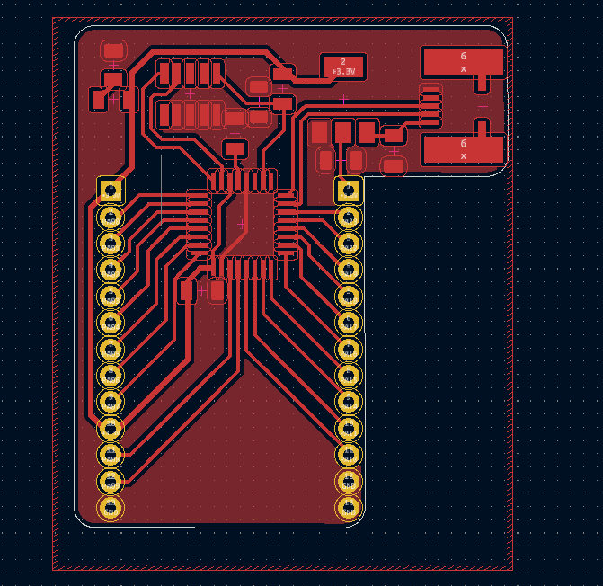

# Week 12: interface programming (MIT How to Make (Almost) Anything, fall 2022)

_Converted from Ahmad's class documentation page (`menya_project/archive/menya_how_to_make/people/Ahmad/page/week-12-details.html`)._

#### Week 12: Application and Interface Programming

- **Date**: November 23rd 2022 - November 30th 2022

##### CAN Bus logger app

Task: Make an app that interfaces with a board that I made

For this weeks assignment I wanted to play around with CAN some more; and since I had to be diligent with my time because of Thanksgiving, I decided to make a CAN logger app.

#### The Design

 For this week I didn't have too much time to make anything crazy so I decided this would be a good idea to do some app development. I decided to use Kivy because it was a good framework for developing applications. Also I could eventually package what I make into an android app. In anycase, I started by making a simple outline for my app. I wanted it to do three simple things: start/stop serial reading and clear the log when it gets filled with data.

 To make any of this work I needed to be able to convert CAN to USB. After last week I had a CAN to SPI bridge. so all I needed was a USB to SPI bridge, I could do this with a samd21 and some Arduino code. I decided to implement the bridge in the form of another dev-board.

#### The App

 I watched a couple tutorials ([here](https://www.youtube.com/watch?v=bMHK6NDVlCM&list=PLzMcBGfZo4-kSJVMyYeOQ8CXJ3z1k7gHn)) on Kivy and read through their docs ([here](https://kivy.org/doc/stable/)). After doing so I wrote some simple code that runs the app and at the same time reads from serial every 16ms. The Kivy framework wont let you have blocking code, and when I tried threading it didnt really work cause it couldn't update graphical elements outside the scope of the app. I could have used multiprocessing with a Pipe or Queue however I only had a couple hours at this point and did not feel like debugging. Hence the reason I went with a simple timer which the app allows (used for animations). The dependencies for the app are PySerial and Kivy.

 [Download Code](../images/week12/app.zip)

#### Full System

 For the full working system I have my CAN sender circuit from last week hooked up to my board from this week, which is connected to my computer. The CAN sender sends two CAN frames every second (random hex data). My logger circuit (on the bread board) reads it and sends it my computer.

[Video: video-result.mp4](../images/week12/video-result.mp4)

#### Next Steps

 For the next steps of this project I want to add more functionality and create a better UI. I also want to create an Android App version of it once its done.
