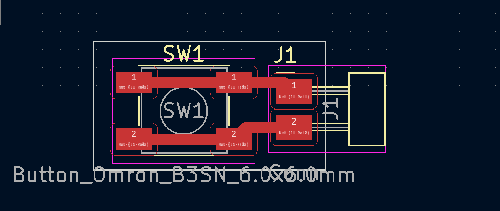
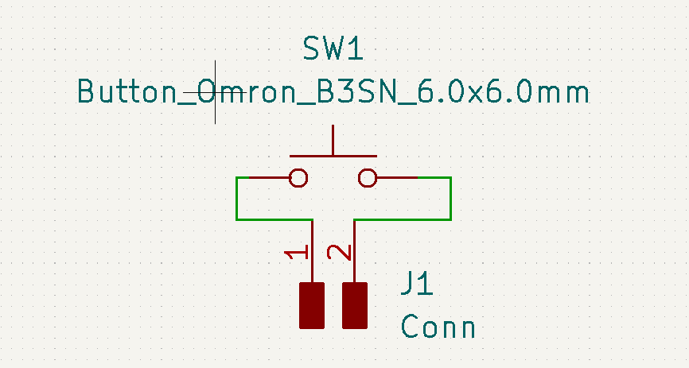
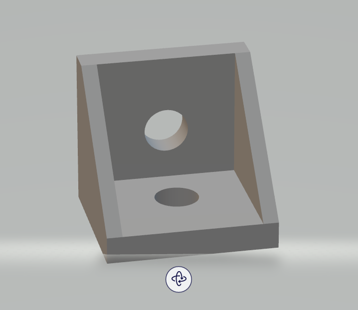

# Week 13: machine building (MIT How to Make (Almost) Anything, fall 2022)

_Converted from Ahmad's class documentation page (`menya_project/archive/menya_how_to_make/people/Ahmad/page/week-13-details.html`)._

#### Week 13: Machine Building

- **Date**: November 30th 2022 - December 6th 2022

##### Machine Building

Task: As a group make a machine for the week

For this weeks assignment we had to build a machine, our group chose a drawing machine.

#### Managing the group

 Although this is one of the smaller things I did; as part of my weekly assignment. I helped manage the group. I created a project github and added emails to it. I also made a google calender however everyone was really good about showing up on time so wasn't really necessary and also wasn't really used. I will say I should have been better about how I added people to the github cause everyone sending there email to me at random times was not as fun as I though it would be.

#### Machining/Printing Components

 More importantly, I machined parts for the frame specifically cutting the aluminum extrusion down to size, I cut 4 2060 aluminum extrusion down to size on the horizontal bandsaw. I also machined another piece of aluminum extrusion which acted as our x-axis. I machined this second piece by cutting it into a 2020 piece. In sum I turned a 2060 into a 2020. I did this by first and taking it to the vertical bandsaw and doing a rough cut. I then sanded the face using a belt sander and did further smoothing using a file. The whole process took about an hour.

 I also acquired a base for our machine in the form of 36" birch plywood sheet. Found this in the recycling at CSAIL. I also found designs ([here](https://grabcad.com/library/2020-extrusion-corner-bracket-1)) and printed corner brackets for our extrusion to do all the framing.

[Video: vertical_bandsaw.mp4](../images/week13/vertical_bandsaw.mp4)

[Video: horizontal_bandsaw.mp4](../images/week13/horizontal_bandsaw.mp4)

#### Designing Simple Limit Switches

 In addition to the machining, our machine needed endstops so I made the worlds most complex board and coincidentally the only machined board on our machine. This board contains a button and pads so we could solder wires to it. It required 0 jumpers and only a few components.

