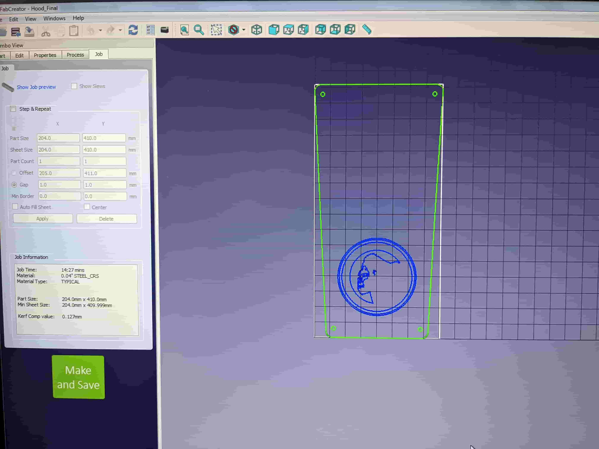
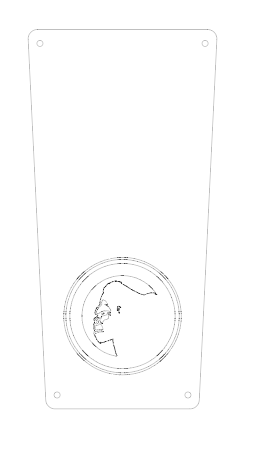
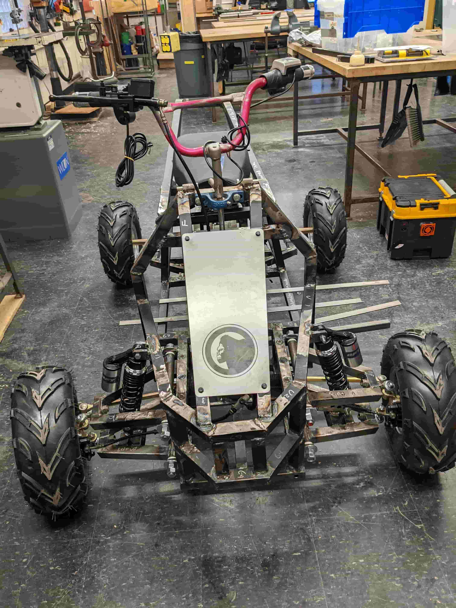
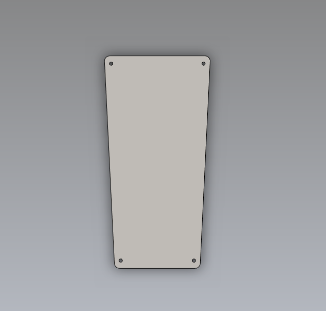

# Week 14: wildcard welding (MIT How to Make (Almost) Anything, fall 2022)

_Converted from Ahmad's class documentation page (`menya_project/archive/menya_how_to_make/people/Ahmad/page/week-14-details.html`)._

#### Week 14: Wildcard Week

- **Date**: December 7th 2022 - December 14th 2022

##### Wildcard

Task: Make something via something that we haven't made something with

For this weeks assignment I have to make something using a technique that we haven't covered in class. I chose to make a simple bonnet/hood for my final project.

#### Attending the Wildcard Training

 On thursday morning I attended the sheet metal and welding training. During the training John from the CBA shop taught me how to use the FabLight laser cutter to cut and etch sheet metal. He went over how to use the software. John also told us what to look out for if the machine isn't cutting properly. After cutting out our metal John taught us how to use the sheet metal bender which was a very fun tool. After all our sheets where bent to shape John should us how to spot weld. In spot welding you can't keep it on too long or you risk blowing a whole and too short and you risk not connecting the parts. So there is a nice window where your welds exist.

[Video: spot-welding-0.mp4](../images/week14/spot-welding-0.mp4)

#### Design of the Hood/Bonnet

 After taking the training, I was inspired to make something out of sheet metal. I decided to make a bonnet for my Final project. I wanted it to be a nice hood that I could easily remove. I took some measurements and came up with a design in SolidWorks for the basic shape. It has mounting holes for where the mounts to the frame. Once I had the basic shape down I exported it as a DXF and then imported it to edit in Adobe Illustrator. The reason I did this is because SolidWorks isn't very good at rendering vector graphics. It often crashes or just slows down tremendously. So the approach I take is to make "rough cuts" in SolidWorks and detailed vector editing, such as adding logos or pictures, in Illustrator. In Illustrator, I imported our group logo as a DXF, which I had saved from a previous week, then I copied it into a sheet with the SolidWorks DXF sketch. Next I positioned it where I wanted to go and then finally I exported the file as a DXF, for Fabricating in FabLight.

#### Fabrication/Assembly

 After getting the final DXF of my part, I went to D-Lab to work on my final project (and welding part of my week) and at the same time use the FabLight that they have there to make my bonnet. Once I got there I told Jack the shop head about my plan, he was on board and gave me some sheet metal (0.04" Mild Carbon Steal Sheet) to use on the project. I then went to the lab computer opened up the FabLight software and began choosing what paths to cut and which to raster. I then generated my make file and put it on a flash drive and walked over to the FabLight. I put the drive into the machine and positioned my file and then hit play. The result was very nice and made my final project look even cooler. I mounted it to my frame using M6 cap screws and some nuts

#### Welding

 At the same time I worked on the bonnet/hood I was also able to do some welding for my final project. Since, I am in charge of the Mechanical aspects of the project, I had to weld the motor mount to a previously welded rear suspension arm. Here I am MIG Welding ([info](https://www.millerwelds.com/resources/article-library/mig-welding-the-basics-for-mild-steel)). Basically MIG welding is type of welding process where a base metal is heated up via electricity, generating a pool of molten metal and filler metal (the wire) is used to fill the gaps between your base metals. The parameters you control in MIG welding are voltage and wire feedrate. These parameters depend on your base metal. There is no on size fits all different settings work for different situations. You just need to do it and see what works. Some tips I've learned: Always test first, clean your base metal well until you see shiny silver, and "grinder and paint make me the welder I aint." Once you get the basics down Welding is very fun, it can be very relaxing and therapeutic.

[Video: welding-0.mp4](../images/week14/welding-0.mp4)
