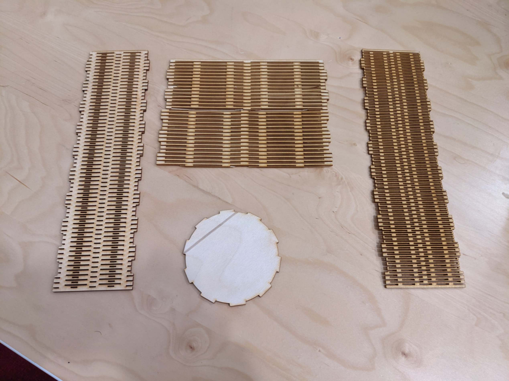

# Week 2: living-hinge box

A parametric living-hinge part designed in SolidWorks and laser-cut into a box (base, walls, cover). The same week included vinyl-cutting my mom's name in Arabic calligraphy.

Full write-up: [week02_laser_and_vinyl_cutting.md](../docs/writeups/week02_laser_and_vinyl_cutting.md).

_Part of [htmaa_2022](../README.md), MIT How to Make (Almost) Anything, fall 2022. Formerly `ivan_project`._

## Status

| Area | Status |
|---|---|
| Mechanical | Done |

## What's here

| Folder | Contents |
|---|---|
| `mechanical/` | CAD (native + exports), CAM — `cad`, `exports` |

See [docs/STRUCTURE.md](docs/STRUCTURE.md) for the layout conventions.

## Build / run

_TODO: tools + versions, and the steps to rebuild or reproduce._

## Results

_TODO: what worked, measurements, photos._
