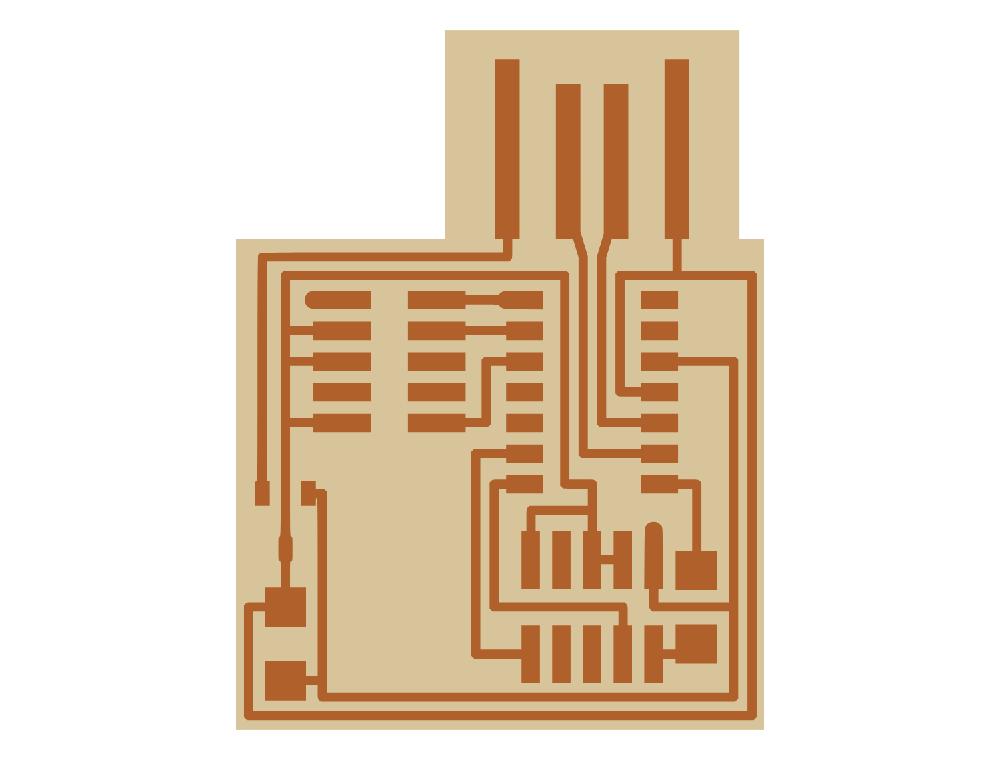

# Week 3: SAMD11C CMSIS-DAP programmer

A milled, hand-soldered **SAMD11C14 (D11C) CMSIS-DAP / SWD programmer**, the class's `hello.CMSIS-DAP.10.D11C` design. Once flashed, it programmed another board.

| Result | Traces |
|---|---|
|  |  |

Full write-up: [week03_electronics_production.md](../docs/writeups/week03_electronics_production.md)

## Files

| Path | What |
|---|---|
| `electrical/cmsis_dap_programmer/programmer_footprint/*.kicad_mod` | Trace and outline footprints converted from the class PNGs with KiCad 6's Image Converter |
| `electrical/cmsis_dap_programmer/untitled.kicad_pcb` | Board built from those footprints |
| `electrical/cmsis_dap_programmer/f_out/` | Gerbers for milling (`F_Cu`, `Edge_Cuts`) |

## Rebuild

1. **Mill:** load `f_out/` into the Bantam mill software. Use a 1/64" end mill for traces and a 1/32" end mill for the outline. The group test found the minimum trace width and clearance for our mill to be **16 mil** with a 1/64" bit. The Bantam software allows only three tool changes, so the write-up describes how to split the job.
2. **Stuff:** solder the SAMD11C14, the 3.3 V regulator, and the header and passives from the class BOM. Use flux and solder paste if you can, then check for shorts with a multimeter.
3. **Flash:** connect an existing CMSIS-compatible programmer (we used an Atmel programmer) to the SWD header, then flash the class's CMSIS-DAP firmware binary with `edbg`.
4. **Test:** use the new programmer to program another board.

## Results

The programmer enumerated and successfully programmed another board. Hand soldering took about 45 minutes, and the one short found was cleared with a solder sucker.

_Formerly `indi_project`. Part of [htmaa_2022](../README.md), MIT How to Make (Almost) Anything, fall 2022._
