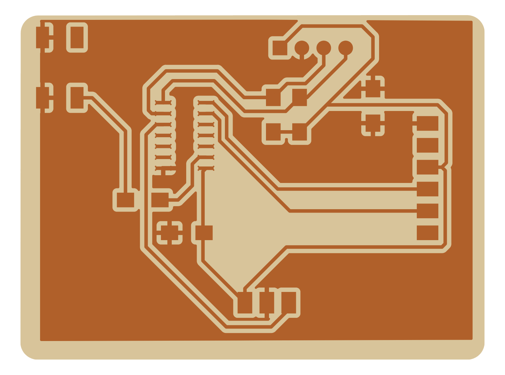

# Week 5: ATtiny1614 OLED display board

An "echo hello-world" board with an **ATtiny1614**, a button, an LED, and an I²C header for a **0.96" SSD1306 OLED**. It was designed as the first version of the audio display for the dashboard of the [Oliya electric ATV](https://github.com/ahmadtak-3212/oliya_project).

| Result | Board render |
|---|---|
|  |  |

Full write-up: [week05_electronics_design.md](../docs/writeups/week05_electronics_design.md)

## Files

| Path | What |
|---|---|
| `electrical/misha_board/Misha_Project.kicad_pro` | KiCad 6 project, 53.8 × 40 mm, milled single-sided with two 0 Ω jumpers and a ground pour |
| `electrical/misha_board/gbr/` | Milling Gerbers (`F_Cu`, `Edge_Cuts`, drill) |
| `electrical/misha_board/ATTINY1614/` | Symbol and footprint for the ATtiny1614-SSF |
| `firmware/firmware.ino` | Display test sketch |

**Connectors:** `J1` I²C (to the OLED), `J2` UPDI (programming), `J3` FTDI serial, and `SW1` button on **PA4**.

## Rebuild

1. Mill with a 1/64" end mill for traces, a 1/32" end mill for the outline and a 1/8" end mill for clearing. The design rules are 16 mil trace and clearance. Sand the board after milling, because a leftover copper sliver caused a short.
2. **Arduino IDE setup:** add `http://drazzy.com/package_drazzy.com_index.json` to the Boards Manager URLs and install Spence Konde's core for the ATtiny 0/1-series (**megaTinyCore**). Select ATtiny1614, with programmer **"Serial UPDI – SLOW"**, and program through a USB-serial adapter on the UPDI header.
3. First flash the class echo sketch (`hello.t1614.echo.ino`) and check it over the FTDI header.
4. Install **Adafruit GFX** and **Adafruit SSD1306**, then upload `firmware/firmware.ino`. The display (128 × 32 at I²C address 0x3C) turns black while the button is held and white otherwise.

## Results

Both the echo test and the display sketch worked. This board was the starting point for the display and audio boards that ended up on Oliya.

_Formerly `misha_project`. Part of [htmaa_2022](../README.md), MIT How to Make (Almost) Anything, fall 2022._
