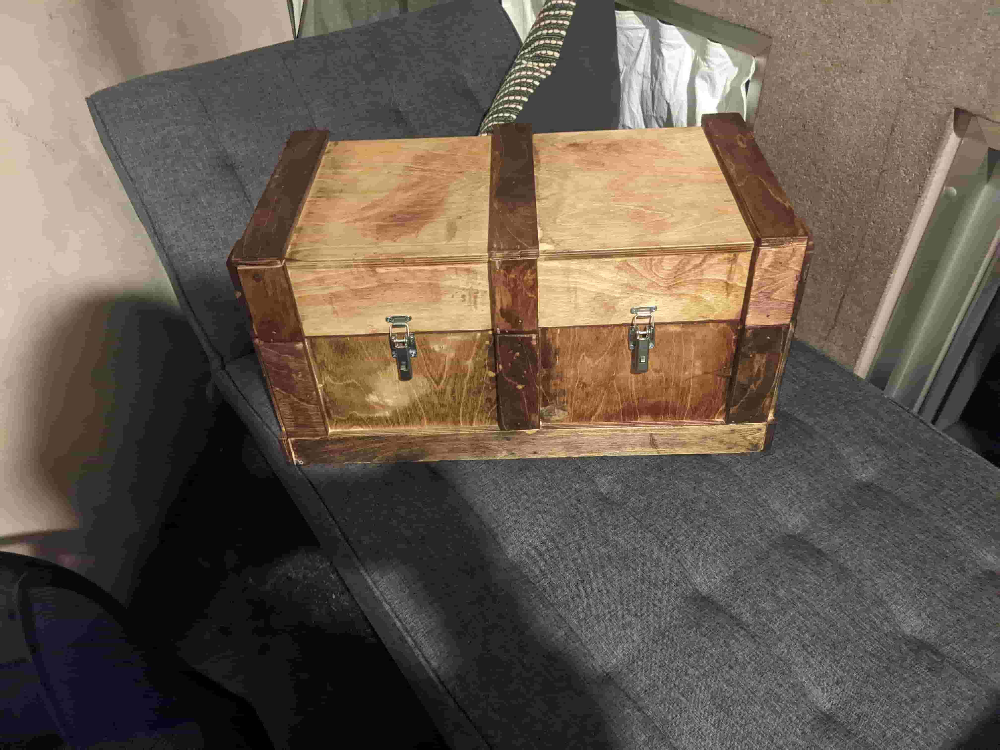

# Week 6: CNC-routed plywood treasure chest

"Make something big": a treasure chest CNC-routed from one **4 ft × 4 ft sheet of birch plywood**. It was assembled with glue and finishing nails, sanded, stained, and fitted with salvaged hardware.

Full write-up: [week06_computer_controlled_machining.md](../docs/writeups/week06_computer_controlled_machining.md)

## Files

| Path | What |
|---|---|
| `mechanical/cad/Petrov.SLDASM` | **Top-down parametric SolidWorks assembly.** A master assembly sketch driven by height, depth and width sizes every panel, cover and accent. `Petrov_Restore.SLDASM` is a backup copy. |
| `mechanical/cad/Parts/` | Panels, covers, wood accents, hinge, and a speaker case |
| `mechanical/cam/Petrov.STEP` | STEP export used for CAM |
| `mechanical/cam/Petrov v3.f3d` | Fusion 360 manufacturing setup with nested parts, toolpaths and tabs |
| `mechanical/exports/stl/Speaker_Case.STL` | Printable speaker case |

## Rebuild

1. Change the three main dimensions in `Petrov.SLDASM` and check that the parts still fit on the sheet.
2. Export a STEP file, then in Fusion 360 lay the parts out on a 47.5" × 47.5" stock with 0.4" spacing.
3. **2D contour**, 3/8" flat end mill: **12,000 RPM, 100 in/min cutting, 40 in/min plunge**. Place tabs by hand, then post-process for the shop router.
4. Cut out the tabs with a bandsaw or oscillating saw. Sand from 80 to 240 grit, glue and nail, stain, and add hinges, handle and locks (#8 pilot holes for the hinges and handle, #6 for the locks).

## Results

The chest was finished and stained. The one problem was that every mating surface came out about **0.05" oversize**, so the parts didn't fit off the router and had to be sanded to fit. For a redo, add a fit offset in the CAD or CAM.

_Formerly `petrov_project`. Part of [htmaa_2022](../README.md), MIT How to Make (Almost) Anything, fall 2022._
