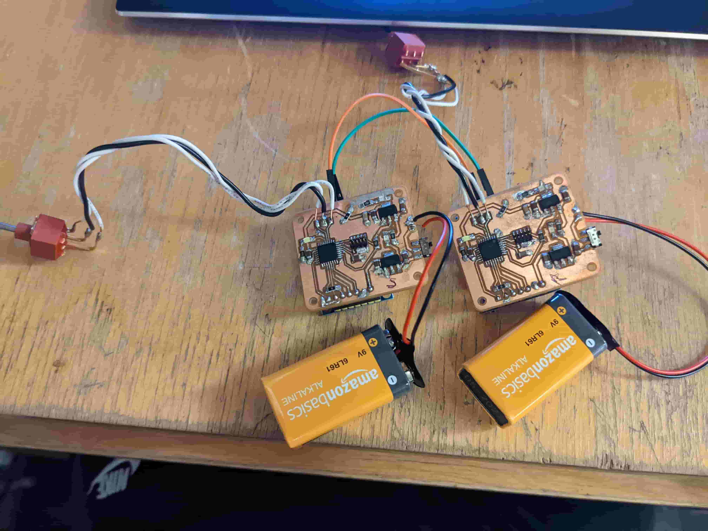

# Weeks 11-12: CAN bus link and logger app

Week 11: a SAMD21 sender/receiver pair with CAN transceivers (one board turns on an LED on the other over CAN), built for CAN experience ahead of the ATV. Week 12: a Kivy desktop app that logs CAN traffic from the board over serial.

Full write-up: [week11_networking.md](../docs/writeups/week11_networking.md). Week 12 write-up: [week12_interface_programming.md](../docs/writeups/week12_interface_programming.md).

_Part of [htmaa_2022](../README.md), MIT How to Make (Almost) Anything, fall 2022. Formerly `khan_project`._

## Status

| Area | Status |
|---|---|
| Electrical | Done (sender + receiver routed; sender Gerbers) |
| Firmware | Early |
| Software | Early (Kivy debugger) |

## What's here

| Folder | Contents |
|---|---|
| `electrical/` | KiCad board projects, circuit sims — `khan_reciever_pcb`, `khan_sender_pcb` |
| `firmware/` | MCU firmware projects — `khan_firmware` |
| `software/` | Host apps, servers, web — `khan_debugger_app` |

See [docs/STRUCTURE.md](docs/STRUCTURE.md) for the layout conventions.

## Build / run

_TODO: tools + versions, and the steps to rebuild or reproduce._

## Results

_TODO: what worked, measurements, photos._
