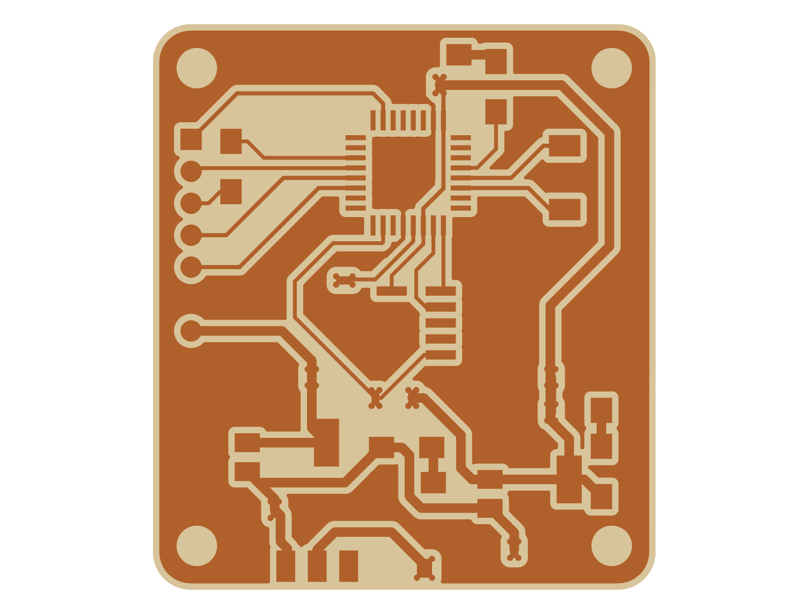

# Weeks 11–12: CAN bus link and logger app

- **Week 11 (networking):** two **SAMD21** boards, each carrying an **MCP2515 CAN controller/transceiver module** and each running on a 9 V battery. The sender transmits two CAN frames every second and blinks an LED each time; the receiver lights an LED whenever it receives an error-free frame. This was a first step toward putting Oliya's electronics on a CAN bus.
- **Week 12 (interface programming):** a **Kivy** desktop app that reads CAN frames forwarded over USB serial and shows them in a scrolling log, with Start, Stop and Clear buttons.

| Boards | Sender PCB |
|---|---|
|  |  |

Write-ups: [week 11](../docs/writeups/week11_networking.md) and [week 12](../docs/writeups/week12_interface_programming.md)

## Files

| Path | What |
|---|---|
| `electrical/khan_sender_pcb/` | KiCad 6, 40 × 45 mm, milled single-sided. **ATSAMD21E18A**, AP1117-5.0 and NCP1117-3.3 regulators, power switch, 10-pin ARM SWD header, 7-pin socket for the MCP2515 module, 2-pin battery input, LEDs. Gerbers are in `out/`. |
| `electrical/khan_reciever_pcb/` | Same design with an RGB status LED (no exported Gerbers; export from KiCad) |
| `firmware/khan_firmware/khan_sender_firmware/` | Sends frames `0x0F6` and `0x036` (8 bytes each) at **125 kbit/s** once per second and blinks the LED on pin 4 |
| `firmware/khan_firmware/khan_reciever_firmware/` | Turns on the LED on pin 4 when `readMessage()` returns `ERROR_OK` |
| `firmware/khan_firmware/khan_firmware.ino` | Scratch sketch (MAX7219 matrix test), not part of the link |
| `software/khan_debugger_app/` | Kivy app: `src/main.py` and `src/khan.kv`; dependencies in `requirements.txt` |

## Rebuild

**Boards:** mill the Gerbers, stuff the parts, and plug in an off-the-shelf MCP2515 module (the 7-pin kind with INT, SCK, SI, SO, CS, GND and VCC). Connect CAN-H to CAN-H and CAN-L to CAN-L between the two modules.

**Firmware:** Arduino IDE with a SAMD21 core, plus the [`autowp/arduino-mcp2515`](https://github.com/autowp/arduino-mcp2515) library. The MCP2515 chip-select pin is 23 (`MCP2515 mcp2515(23)`). Flash over the SWD header, for example with the week 3 programmer.

**App:**
```bash
cd software/khan_debugger_app
python -m venv venv && source venv/bin/activate      # Windows: venv\Scripts\activate
pip install -r requirements.txt                       # Kivy 2.1, pyserial 3.5 (pinned on Python 3.9)
python src/main.py
```
The serial port is hard-coded as `COM11` at 115200 baud in `src/main.py`, so change it to match your USB-serial bridge. The app polls serial on a Kivy `Clock` timer (every 1/60 s) instead of a thread, because Kivy can't update widgets from another thread.

## Results

The CAN link worked: frames reached both the receiver board and the logger app. The write-up has videos and describes the one major firmware bug. The USB-to-CAN logger used for week 12 was a SAMD21 dev board acting as a USB-to-SPI bridge on a breadboard; see the week 12 write-up.

_Formerly `khan_project`. Part of [htmaa_2022](../README.md), MIT How to Make (Almost) Anything, fall 2022._
